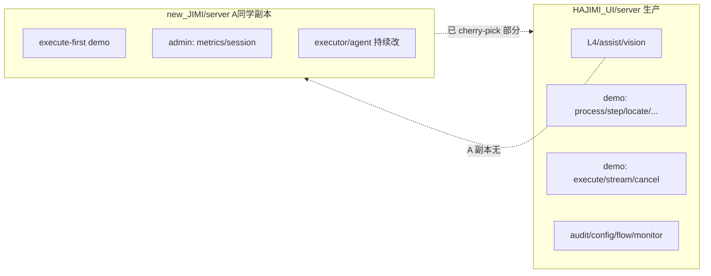
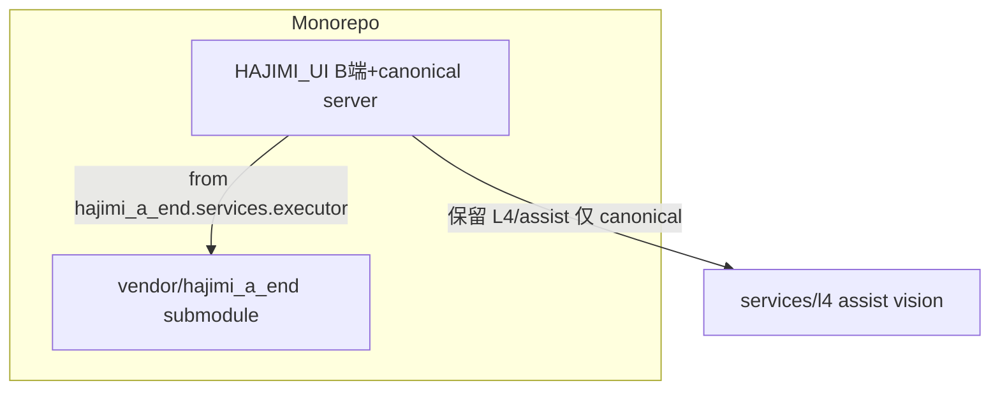

# A 端集成现状与跨文件夹调用方案

## 1. 是否已把 A 同学改动「全部」集成进旧 server？

**没有整包替换，是「绞杀榕式增量合并」。** 生产入口仍是 [`HAJIMI_UI/server`](HAJIMI_UI/server)，[`new_JIMI/HAJIMI_UI/server`](new_JIMI/HAJIMI_UI/server) 是**同级副本**（非 git submodule，仓库内无 `new_JIMI` 引用）。



### 已集成（L5 Round 1–6 实施范围）

| 类别 | 状态 |
|------|------|
| 路由接线 | `audit`, `config_client`, `auth`, `flow`, `monitor` 已在 [`main.py`](HAJIMI_UI/server/main.py) 注册 |
| L5 三端点 | [`demo.py`](HAJIMI_UI/server/routes/demo.py) 新增 `/execute` `/stream/{id}` `/cancel` |
| executor/agent | [`services/executor/`](HAJIMI_UI/server/services/executor/) 等**此前已拷贝**，本次补接线 + schema |
| B 端 L5 UI | `ExecuteWorkerThread`、设置页 `l5` 路由等 |

### 未集成 / 仍可能落后于 A 同学最新版

| 缺口 | new_JIMI 有 | canonical 现状 |
|------|-------------|----------------|
| Admin 指标 | `GET /api/admin/metrics`、`POST .../metrics/reset`、`GET .../session/status` | [`admin.py`](HAJIMI_UI/server/routes/admin.py) **无** 这三项 |
| executor/agent **后续 bugfix** | A 持续改 | 需人工 diff，**不会自动同步** |
| demo `/health` 行为 | OmniParser 不可达时 **503** | canonical 仍 **200 + 字段**（保留 B 端 L4 预检逻辑） |
| A 副本缺失的能力 | — | L4、assist、inspect/step/locate 等 **只在 canonical** |

**结论：** canonical 是 **B 端指引 + L5 的 superset**；A 副本是 **execute 专精 snapshot**。两边会**持续分叉**，除非建立固定同步机制。

---

## 2. 能否跨文件夹直接调 A 同学的模块？

**能，但不建议「运行时双路径 import 同一个 `server` 包名」。**

当前启动方式（[`scripts/start_server.bat`](HAJIMI_UI/scripts/start_server.bat)）：

```text
cd HAJIMI_UI
python -m uvicorn server.main:app
```

Python 只认 **一个** 顶层包 `server`。若同时把两个目录加入 `sys.path`：

```python
# 危险示例 — 不要这样做
sys.path.insert(0, "new_JIMI/HAJIMI_UI")
sys.path.insert(0, "HAJIMI_UI")
from server.services.executor.engine import run_plan_agent_loop  # 不确定来自哪棵树
```

会出现：**导入歧义、一半文件来自 A 一半来自 B、pytest/热重载随机失败**。

### 可行方案对比

| 方案 | 做法 | A 同学持续改时 | 风险 |
|------|------|----------------|------|
| **A. 定期 merge（现状）** | `diff new_JIMI/.../executor vs HAJIMI_UI/.../executor`，cherry-pick 到 canonical | 需约定频率 + 冲突人工解 | 低；已验证 |
| **B. Git submodule + 改名** | A 仓库 → `vendor/hajimi_a_end/`，包名改为 `hajimi_a_end.server...`，canonical 显式 `from hajimi_a_end.server.services.executor import ...` | `git submodule update` 拉 A 最新 | 中；需 A 配合独立 repo + 命名空间 |
| **C. pip editable** | `pip install -e ../new_JIMI/HAJIMI_UI` 且 A 端改 `pyproject` 包名 | A push 后你们 `pip install -e` 刷新 | 中；环境管理复杂 |
| **D. 目录 symlink** | Windows junction 把 `executor/` 链到 new_JIMI | A 改文件即生效 | **高**；L4 与 A 路由冲突、Windows 权限、难 review |
| **E. 进程分离（HTTP）** | A 只跑 `new_JIMI` 的 uvicorn :8010；B 只调 REST | A 任意改，B 只看 API 契约 | **最低耦合**；不能在同一进程混用 L4+L5 除非 A 也实现 L4 |

**推荐默认：继续 A（canonical 唯一源码）+ 短期补 admin 三端点；若 A 改动极频且你们不同机部署，再考虑 E。**

跨文件夹「零 merge、自动跟 A」只有 **B 或 C** 真正可行，且必须 **改掉 `server` 这个冲突包名**。

---

## 3. 若选「跨目录自动跟 A」的最小改造（方案 B 草图）



实施要点（未来若采纳）：

1. A 同学仓库独立化，`pyproject.toml` 包名 `hajimi_a_end`（或 `hajimi_executor` 只抽 executor/agent）。
2. 根目录 `.gitmodules` 添加 submodule；CI 跑 `submodule update --init`。
3. canonical [`demo.py`](HAJIMI_UI/server/routes/demo.py) 的 L5 路径改为：
   - `from hajimi_a_end.services.executor.engine import run_plan_agent_loop`
   - L4/process 仍用 canonical 本地 `services/l4/`。
4. 契约测试：[`scripts/verify_l5.py`](HAJIMI_UI/scripts/verify_l5.py) + A 端提供的 `API-CONTRACT.md` 对齐。

**不改造包名就跨目录 import = 技术债，不建议。**

---

## 4. 短期可执行补漏（不改变协作模式）

在继续「canonical 唯一源码」前提下，建议下一轮只做小 diff：

1. **Admin 三端点**：从 [`new_JIMI/.../routes/admin.py`](new_JIMI/HAJIMI_UI/server/routes/admin.py) 移植 `/metrics`、`/metrics/reset`、`/session/status` 到 canonical [`admin.py`](HAJIMI_UI/server/routes/admin.py)（web-admin 可能已依赖）。
2. **同步脚本（可选）**：`scripts/sync_a_executor.py` — 对 `executor/`、`agent/`、`planning/planner.py` 做三方 diff 报告，不自动覆盖。
3. **协作约定**：A 改 executor 时在 PR 里 @B 端；B 端 weekly cherry-pick + `pytest server/tests` + `verify_l5 --require-a`。
4. **文档**：在 [`HANDOFF.md`](HAJIMI_UI/HANDOFF.md) 写清「canonical vs new_JIMI 关系，new_JIMI 只作参考副本，非运行时依赖」。

---

## 5. 直接回答你的两个问题

1. **「是不是全部集成到旧 server 了？」**  
   → **L5 主路径已集成**，但 **不是** new_JIMI 整包；canonical **更全**（L4/指引 API），**更缺** admin metrics 等；A 同学**之后的新 commit 不会自动进来**。

2. **「有办法跨文件夹调他的模块吗？」**  
   → **同一进程、同一 `server` 包名下直接跨文件夹 import：不推荐。**  
   → **可行路径**：submodule + 独立包名（开发时跟 A）、或 **A 独立进程 + HTTP**（部署时跟 A）。  
   → **当前最省事**：保持 [`HAJIMI_UI/server`](HAJIMI_UI/server) 为唯一运行源码，new_JIMI 当 diff 源。

---

## 6. 建议决策

| 若你们… | 选 |
|---------|-----|
| 同一台机、同一 uvicorn、要 L4+L5 共存 | **A 定期 merge**（现状加强） |
| A 改得很快、B 只关心 API、可接受双进程 | **E HTTP 分离** |
| 想要 `git pull` 即更新 executor、愿改包结构 | **B submodule + 改名** |

你选了「还不确定」——建议先维持 **A + 短期补 admin 三端点**；等 A 同学改 executor 频率超过你们 weekly merge 能力，再评估 **B 或 E**。
