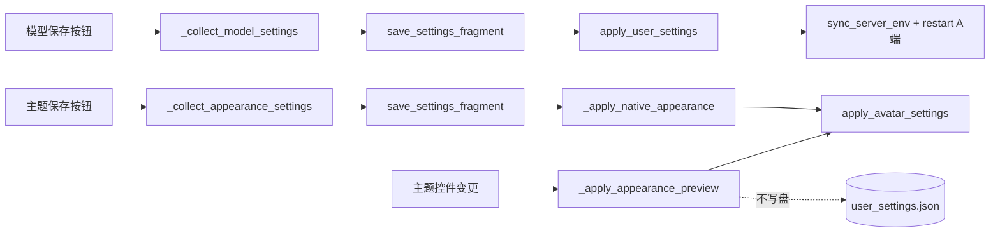

# HAJIMI 实训 DAY7 工作内容（v2）

> **日期**：2026-07-06  
> **角色**：B 端（前端 / 桌面应用）  
> **文档版本**：v2 · 2026-07-06

---

## 一、DAY7 目标

| 路线阶段 | DAY7 对应里程碑 |
|----------|-----------------|
| **设置页完善** | 模型/主题解耦 + 橘猫头像 + 透明度范围 + 分块保存 |
| **L5 整合** | new_JIMI Agent Loop 增量并入 canonical `server/` + B 端 L5 UI |
| **ABC 协作** | 整理 A/C 待办文档索引，记录 B 端已接线与剩余缺口 |

**DAY7 核心目标**：

1. 设置页 **模型设置在上、主题外观在下**，两个独立「保存并应用」  
2. 主题预览与模型表单 **互不覆盖**；分块写盘先读磁盘再 merge  
3. 橘猫 AI/用户头像 **持久化 + 浏览/清除 + 实时预览**  
4. 透明度滑条仅在 **默认蓝 / 典雅黑 / 橘猫** 详细设置中显示  
5. **L5 自动执行**：默认指引路由 `l5`，保留 L2/L3/L4 并行；不采用 new_JIMI 独立 AgentPanel  
6. **ABC 文档落盘**：A/C 改动清单写入本文档 §九–§十一，便于发给组员  
7. 补自动化验证脚本，不改动 DAY1–6 历史文档  

---

## 二、DAY7 任务清单

### 2.1 设置页 A 部分补充 — 透明度三方案

| # | 任务 | 涉及文件 | 状态 |
|---|------|----------|------|
| 1 | 默认蓝详细页增加 `_default_detail_layout` | `ui/native/settings_widgets.py` | ✅ |
| 2 | `sync_scheme_sections()`：默认蓝/典雅黑/橘猫 reparent `_classic_alpha_section` | 同上 | ✅ |
| 3 | 黑金轻奢 / 牛皮纸不挂载 alpha（hide + 从 layout 移除） | 同上 | ✅ |

### 2.2 橘猫头像持久化与设置 UI

| # | 任务 | 涉及文件 | 状态 |
|---|------|----------|------|
| 1 | 新增 `orange_cat_ai_avatar` / `orange_cat_user_avatar` 字段 | `core/user_settings.py` | ✅ |
| 2 | `_merge_ui_settings` 合并 avatar 路径 | 同上 | ✅ |
| 3 | `set_ai_avatar_path` / `apply_avatar_settings`，settings 优先于 bundled 扫描 | `ui/native/orange_cat/image_pool.py` | ✅ |
| 4 | 橘猫详细区：路径框 + 浏览 + 清除（AI / 用户） | `ui/native/settings_widgets.py` | ✅ |
| 5 | `current_appearance()` / `set_appearance()` 读写 avatar 字段 | 同上 | ✅ |

### 2.3 头像实时预览

| # | 任务 | 涉及文件 | 状态 |
|---|------|----------|------|
| 1 | 预览/保存时 `_sync_orange_cat_chrome(..., avatar_data=)` 注入路径 | `ui/main_widget.py` | ✅ |
| 2 | compact 小窗 mark 刷新 | `ui/native/compact_bar.py`（经 `apply_orange_cat_theme`） | ✅ |
| 3 | welcome + 对话区全部 `OrangeCatChatRow.refresh_avatar()` | `ui/native/medium_panel.py` | ✅ |

### 2.4 模型设置整合（ModelSettingsGroup）

| # | 任务 | 涉及文件 | 状态 |
|---|------|----------|------|
| 1 | 单 Card「模型设置」：部署模式 → 指引路由 → 模型 API → L4 | `ui/native/settings_widgets.py` | ✅ |
| 2 | `DeploymentModeGroup` / `GuidanceRouteGroup` / `L4VisionGroup` 支持 `embedded=True` | 同上 | ✅ |
| 3 | 设置页顺序：模型 → 主题外观 → 开发者 | `ui/native/medium_panel.py` | ✅ |
| 4 | 移除原独立 API Card 及底部重复保存按钮 | 同上 | ✅ |
| 5 | Enter 提交绑定模型保存 | `SettingsEnterFilter` → `_save_model_settings` | ✅ |

### 2.5 双保存 + 分块 merge（模型/主题解耦）

| # | 任务 | 涉及文件 | 状态 |
|---|------|----------|------|
| 1 | `save_settings_fragment()`：先 `load_user_settings()`，深合并 llm/omniparser/l4 | `core/user_settings.py` | ✅ |
| 2 | `_collect_model_settings()` / `_collect_appearance_settings()` 分离 | `ui/native/medium_panel.py` | ✅ |
| 3 | 信号 `model_settings_saved` / `appearance_settings_saved` | 同上 | ✅ |
| 4 | 模型保存：`apply_user_settings` + 条件 `sync_server_env` / `restart_local_a_end` | `ui/main_widget.py` | ✅ |
| 5 | 主题保存：仅 `save_settings_fragment` + `_apply_native_appearance`，**不重启 A 端** | 同上 | ✅ |
| 6 | 主题预览：只 emit appearance dict，不写盘、不读模型表单 | `medium_panel._forward_appearance_preview` | ✅ |

### 2.6 自动化验证

| # | 任务 | 命令 / 路径 | 状态 |
|---|------|-------------|------|
| 1 | 主题 apply 回归 | `python scripts/verify_theme_apply.py` | ✅ ok |
| 2 | 分块保存 / 解耦 / alpha 方案 / avatar 注入 | `python scripts/verify_settings_fragment.py` | ✅ ok |

### 2.7 L5 整合 — Server（PR-1 / PR-2）

| # | 任务 | 涉及文件 | 状态 |
|---|------|----------|------|
| 1 | 注册 audit / config / auth / flow / monitor 路由 | `server/main.py`, `server/routes/*.py` | ✅ |
| 2 | demo 追加 `/execute` `/stream/{id}` `/cancel` | `server/routes/demo.py` | ✅ |
| 3 | L5 规划模块 `plan_for_execute` | `server/services/planning/execute_planning.py` | ✅ |
| 4 | Schema：`PlanningStep` / `ExecutedStep` / `CancelRequest` / `goal` | `server/models/schemas.py` | ✅ |
| 5 | 依赖：pyautogui / pyperclip / psutil | `server/requirements.txt` | ✅ |
| 6 | executor 增量合并（非整包覆盖 new_JIMI） | `server/services/executor/` | ✅ 基线已有，后续 diff |
| 7 | Admin 三端点（metrics / session）从 new_JIMI 移植 | `server/routes/admin.py` | ⏳ 待办 |

### 2.8 L5 整合 — B 端 UI（PR-3）

| # | 任务 | 涉及文件 | 状态 |
|---|------|----------|------|
| 1 | 默认 `routing_mode=l5`；`auto` 不含 L5 | `core/user_settings.py`, `core/routing_config.py` | ✅ |
| 2 | 设置页「指引路由」增加 L5 首项 | `ui/native/settings_widgets.py` | ✅ |
| 3 | `ExecuteWorkerThread` + `/execute` + SSE | `core/execute_worker.py`, `core/api_client.py` | ✅ |
| 4 | 步骤页 L5 样式、日志条、自动切页 | `ui/native/medium_panel.py` | ✅ |
| 5 | 首次 L5 知情弹窗 + H/J 快捷键 + 停止按钮 | `medium_panel`, `app_controller`, `main_widget` | ✅ |
| 6 | L5 审计映射 L3（不改 bc_signals 契约） | `ui/app_controller.py` `_emit_audit` | ✅ |
| 7 | SSE → TTS / 任务结束 audit | `ui/app_controller.py` `on_l5_sse_event` | ✅ |
| 8 | `ui/agent_panel.py` | 不挂载、不删（LEGACY） | ✅ 按约定保留 |

### 2.9 L5 验收（PR-4）

| # | 任务 | 命令 / 路径 | 状态 |
|---|------|-------------|------|
| 1 | L5 冒烟脚本 | `python scripts/verify_l5.py --require-a` | ✅ 新增 |
| 2 | 纳入一键验收 | `scripts/verify_all.py` | ✅ |
| 3 | HANDOFF L5 说明 | `HANDOFF.md` §4 | ✅ |

---

## 三、架构说明

### 3.1 保存数据流



### 3.2 关键 API

| API | 说明 |
|-----|------|
| `save_settings_fragment(fragment)` | Python 函数，非 cmd 命令；应用内两个保存按钮自动调用 |
| `apply_avatar_settings(data)` | 将 `orange_cat_*_avatar` 注入 `image_pool`，优先于 bundled 扫描 |
| `refresh_orange_cat_avatars()` | 刷新 welcome + `_chat_layout` 内所有带 `refresh_avatar` 的行 |

### 3.3 未纳入本次（计划明确不做）

- 主题/模型「未保存」离开提示  
- `AppearanceSettings` dataclass 内嵌 avatar 字段（采用 dedicated keys，功能等价）  
- 修改 DAY1–6 历史工作文档（DAY3 等保持原样）  

---

## 四、DAY7 交付物

| 交付物 | 路径 |
|--------|------|
| 分块保存与解耦验证脚本 | `scripts/verify_settings_fragment.py` |
| 模型设置整合组件 | `ui/native/settings_widgets.py` → `ModelSettingsGroup` |
| 用户设置分块写盘 | `core/user_settings.py` → `save_settings_fragment` |
| 橘猫头像持久化 | `core/user_settings.py`, `ui/native/orange_cat/image_pool.py` |
| 双 save handler | `ui/main_widget.py` → `_on_model_settings_saved`, `_on_appearance_settings_saved` |
| L5 execute 规划 | `server/services/planning/execute_planning.py` |
| L5 B 端 worker | `core/execute_worker.py` |
| L5 验收脚本 | `scripts/verify_l5.py` |
| ABC 协作文档（详细版） | `docs/A端-ABC整合改动指南.md`, `docs/C端-ABC整合对齐指南.md` |
| 本日工作总结 | `docs/DAY7-工作内容_v2.md`（本文档） |

---

## 五、验收标准（可脚本 + 手动）

### 5.1 自动化（已通过）

```powershell
python scripts/verify_theme_apply.py
python scripts/verify_settings_fragment.py
python scripts/verify_bc_signals.py
# 全栈（需 A 端 :8010）
python scripts/verify_all.py --require-a
python scripts/verify_l5.py --require-a
```

### 5.2 手动走查（可选）

1. 改模型 API **不保存** → 切主题方案预览 → 模型输入框内容不变  
2. 改主题 **不保存** → 仅模型保存 → 磁盘主题为旧值，UI 预览可保留  
3. 橘猫：选头像 → 中/小窗及已有对话气泡即时更新；主题保存后重启仍保留  
4. 五方案：仅默认蓝 / 典雅黑 / 橘猫见透明度滑条  

---

## 六、主要改动文件一览

| 文件 | 改动摘要 |
|------|----------|
| `core/user_settings.py` | avatar 字段、`save_settings_fragment`、`_deep_merge_fragment` |
| `ui/native/orange_cat/image_pool.py` | avatar override + `apply_avatar_settings` |
| `ui/native/settings_widgets.py` | alpha 三方案、avatar UI、`ModelSettingsGroup`、embedded 子组 |
| `ui/native/medium_panel.py` | 页面重组、双 collect/save、`refresh_orange_cat_avatars` |
| `ui/main_widget.py` | 双 save handler、预览 avatar 注入 |
| `scripts/verify_settings_fragment.py` | 新增 |
| `server/routes/demo.py` | L5 execute/stream/cancel |
| `server/routes/audit.py` 等 | ABC P0 路由 |
| `core/execute_worker.py` | L5 SSE worker |
| `ui/app_controller.py` | L5 分支、审计 L3 映射、SSE 钩子 |
| `scripts/verify_l5.py` | L5 冒烟 |

---

## 七、快速命令参考

```powershell
# 启动
python main.py

# DAY7 验收脚本
python scripts/verify_theme_apply.py
python scripts/verify_settings_fragment.py
python scripts/verify_bc_signals.py
python scripts/verify_l5.py --require-a
python scripts/verify_all.py --require-a

# 查看当前用户设置（JSON）
python -c "from core.user_settings import load_user_settings; import json; print(json.dumps(load_user_settings(), indent=2, ensure_ascii=False))"
```

> 设置文件路径：`%LOCALAPPDATA%\HAJIMI\user_settings.json`

---

## 八、参考

- 实施计划：设置页 A 部分补充 + 模型/主题解耦（Cursor plan，不修改 plan 文件本身）  
- L5 整合：六轮讨论定案 + 增量合并（非 new_JIMI 整包替换）  
- 主题六轮整合（前置）：五配色方案 UI、`variant_b/c` 删除、预览与迁移 — 见前期 commit / 会话记录  
- 历史文档：`docs/DAY3-工作内容_v2.md` 等 **未因 DAY7 回写修改**

---

## 九、L5 与 new_JIMI 关系（给全组）

**结论**：生产 canonical 为 [`../server`](../server)；[`../../new_JIMI/HAJIMI_UI/server`](../../new_JIMI/HAJIMI_UI/server) 为 A 同学**同级参考副本**（非 git submodule），**运行时不会跨文件夹 import**。

| 能力 | canonical `HAJIMI_UI/server` | `new_JIMI/.../server` |
|------|-------------------------------|------------------------|
| L4 / assist / 指引 API | 有（process/step/locate/…） | 无 |
| L5 execute/stream/cancel | 已接线 | 有（A 持续改 executor） |
| audit/config/flow/monitor | 已注册 | 有 |
| Admin metrics/session | **待移植** | 有 3 个额外端点 |

**协作建议**：A 同学改 executor 后，B 端定期 `diff` cherry-pick 到 canonical；不要双 `sys.path` 同时 import 两个 `server` 包。

**部署**：A 端本机 `:8010`；OmniParser 可远程 `:9800`；L5 的 pyautogui 必须在用户本机。

---

## 十、A 端待办摘要（详细版 → [`A端-ABC整合改动指南.md`](A端-ABC整合改动指南.md)）

> 契约：[`../../参考文档/a-c-api-contract.md`](../../参考文档/a-c-api-contract.md)

### P0 — C 联调（B 端 DAY7 已在 canonical 落地）

| 端点 | 文件 | DAY7 状态 |
|------|------|-----------|
| `POST /api/audit/report` | `server/routes/audit.py` | ✅ 已迁入并注册 |
| `GET /api/config/pull` | `server/routes/config_client.py` | ✅ 已迁入并注册 |

自测：

```powershell
curl -X POST http://127.0.0.1:8010/api/audit/report -H "X-Demo-Key: hajimi-demo-2026" -H "Content-Type: application/json" -d "{\"client_id\":\"test\",\"batch\":[]}"
curl http://127.0.0.1:8010/api/config/pull -H "X-Demo-Key: hajimi-demo-2026"
python client/audit_e2e_test.py   # 根项目，需真实 A 端
```

### P1 — Web 管理面板（A 同学仍需对齐或 B 端补移植）

| 端点 | 说明 | DAY7 状态 |
|------|------|-----------|
| `POST /api/audit/feedback` | 单条反馈 | ✅ 随 audit 路由 |
| `GET /api/admin/flow/*` | topology / metrics / versions | ✅ flow 路由 |
| `GET /api/admin/monitor/*` | health / alerts | ✅ monitor 路由 |
| `POST /api/auth/login` | JWT 登录 | ✅ auth 路由 |
| `GET /api/admin/metrics` | 执行指标 | ⏳ 仅 new_JIMI 有 |
| `POST /api/admin/metrics/reset` | 重置指标 | ⏳ 仅 new_JIMI 有 |
| `GET /api/admin/session/status` | Agent 会话状态 | ⏳ 仅 new_JIMI 有 |
| `POST /api/admin/config/deploy` | JSON body 与 web-admin 一致 | 需核对形状 |

### P2 — Demo 契约

| 项 | DAY7 状态 |
|----|-----------|
| `/health/live`、L4/locate/relocate 等 | ✅ canonical 已有 |
| L5 `/execute` `/stream` `/cancel` | ✅ DAY7 新增 |
| `api-contract-demo_v2.yaml` 补 L5 字段 | ⏳ 文档待更新 |
| `clarify` 使用 `request.answer` | ⏳ 行为待增强 |

---

## 十一、C 端待办摘要（详细版 → [`C端-ABC整合对齐指南.md`](C端-ABC整合对齐指南.md)）

> 契约：[`b-c-api-contract.md`](b-c-api-contract.md) · B 端总览：[`B端接口总结-对A与对C_v2.md`](B端接口总结-对A与对C_v2.md)

### B 端已接线（C 对齐即可）

| 能力 | B 侧 | 验收 |
|------|------|------|
| 九信号总线 | `core/bc_signals.py` | `python scripts/verify_bc_signals.py` |
| ASR / TTS / 语音设置 | `main_widget._wire_controller` | 需本机 mic + Vosk |
| 审计 emit | `AppController._emit_audit` | L3/L4 任务结束；**L5 映射为 L3** |
| 配置热更 | `config_updated` | 依赖 A `GET /api/config/pull` |

### C 端仍需改动

| # | 项 | 建议 |
|---|-----|------|
| 1 | `server_url` | 统一 **8010**（勿用 :8000） |
| 2 | `audit_queue.db` | 迁至 `%LOCALAPPDATA%/HAJIMI/` |
| 3 | 信号时序 | `bind_to()` 与 `start()` 顺序；C 侧防漏绑 |
| 4 | C→A HTTP | 依赖 P0 audit/config（A 端 DAY7 已提供） |
| 5 | L5 后 TTS/audit | B 已在 SSE `step_done` / `task_done` 挂钩；C 无需改契约 |

### C 自测

```powershell
# 根项目
python client/voice_setup.py
python client/bc_integration_test.py
python client/audit_e2e_test.py

# B 端
cd HAJIMI_UI
python scripts/verify_bc_signals.py
```

---

## 十二、文档索引（发给 A/C 同学）

| 读者 | 文档 | 路径 |
|------|------|------|
| A 负责人 | A 端 ABC 整合改动指南 | `docs/A端-ABC整合改动指南.md` |
| C 负责人 | C 端 ABC 整合对齐指南 | `docs/C端-ABC整合对齐指南.md` |
| 全员 | B 端接口总结（对 A / 对 C） | `docs/B端接口总结-对A与对C_v2.md` |
| A↔C HTTP | a-c-api-contract | [`../../参考文档/a-c-api-contract.md`](../../参考文档/a-c-api-contract.md) |
| B↔C 信号 | b-c-api-contract | `docs/b-c-api-contract.md` |
| Demo OpenAPI | api-contract-demo v2 | `docs/api-contract-demo_v2.yaml` |
| 交接索引 | HANDOFF | `HANDOFF.md` |
| A 变更日志 | CHANGELOG-A端 | `server/docs/CHANGELOG-A端_v2.md` |
| L5 execute 契约（A 副本） | API-CONTRACT | `new_JIMI/HAJIMI_UI/docs/API-CONTRACT.md`（参考，非运行时） |
