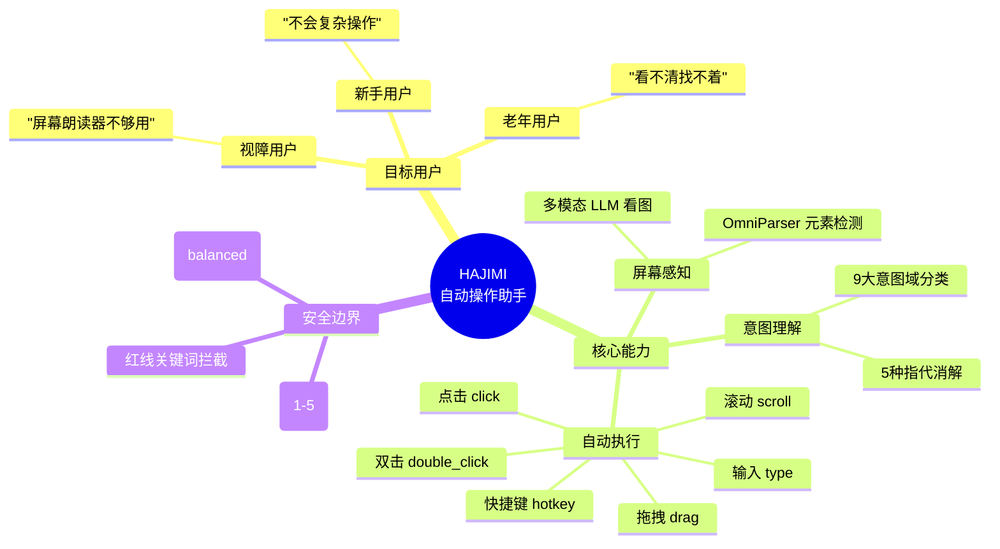
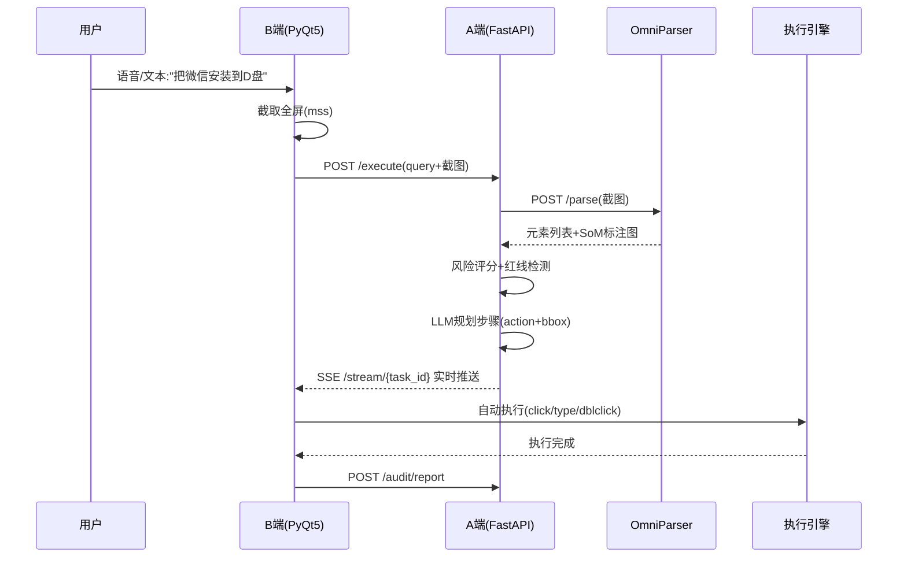
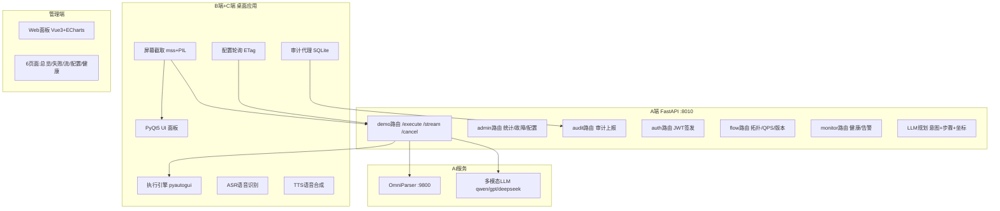
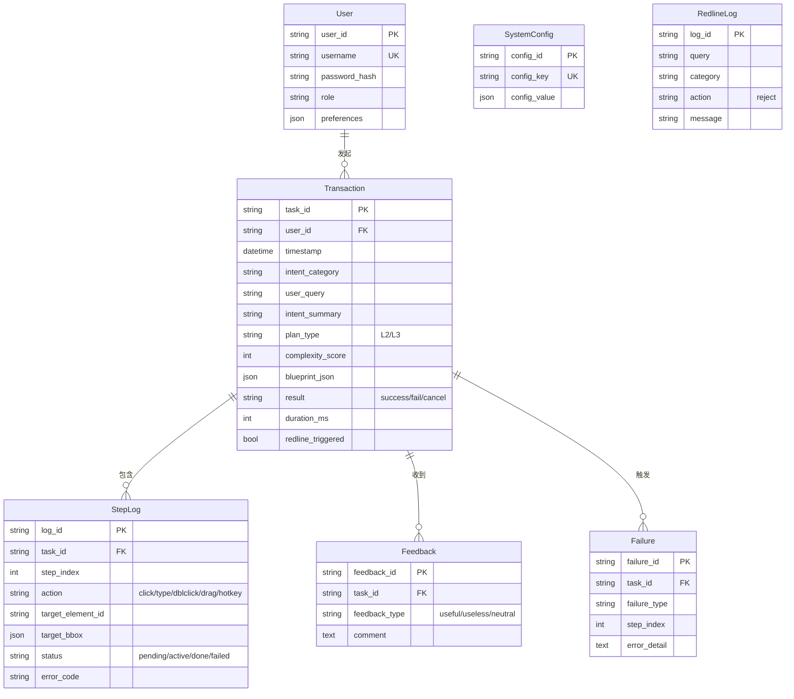
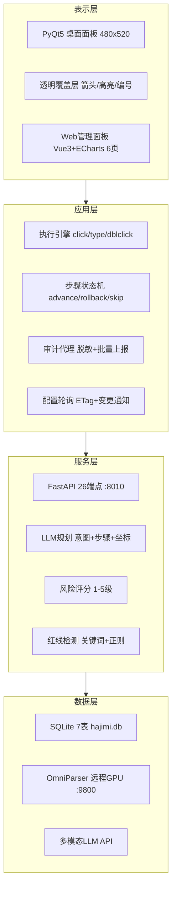
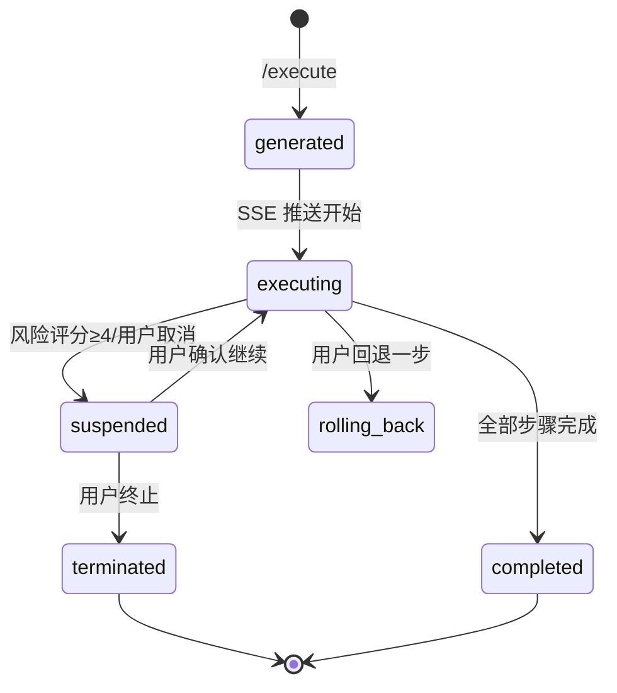
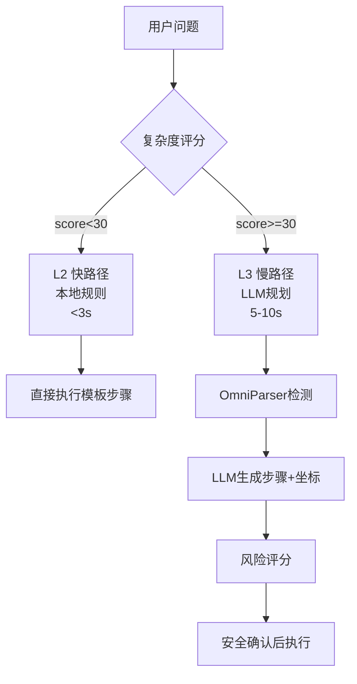

# HAJIMI 自动操作助手 — 图表与 UML 描述 V2.0

> **版本**：V2.0 | **日期**：2026-07-06  
> 本文档配合概要设计文档使用，提供全部架构图、流程图、ER 图的 Mermaid/PlantUML 描述。  
> **注意**：V2.0 起系统从"桌面指引"升级为"自动操作助手"——可直接代为点击/输入/双击。

---

## 图1 项目定位图

### 文字描述

- **顶部**：标题 "HAJIMI 自动操作助手"
- **左侧**：三类目标用户（新手/老年/视障）及其核心痛点
- **中间**：系统核心能力链 —— 屏幕感知 → 意图理解 → 自动执行（点击/输入/双击）
- **右侧**：安全边界 —— 风险评分 + 红线检测 + 信任级别
- **底部**：价值主张 —— 降低操作门槛、实时上下文、自动完成任务



---

## 图2 核心业务时序图



---

## 图3 系统功能模块结构图



---

## 图4 E-R 实体结构图



---

## 图5 系统四层逻辑架构图



---

## 图6 网络部署架构图

```
┌─────────────────────────────────────────────┐
│  本地 PC (Windows)                          │
│  ┌─────────┐  ┌──────────┐  ┌────────────┐  │
│  │ B端 GUI │  │ A端 :8010│  │ Web :5173  │  │
│  │ PyQt5   │  │ FastAPI  │  │ Vue3       │  │
│  └────┬────┘  └────┬─────┘  └─────┬──────┘  │
│       │            │              │          │
└───────┼────────────┼──────────────┼──────────┘
        │            │              │
   SSH隧道:9800   本地 :8010    本地 :5173
        │            │              │
┌───────┴────────────┴──────────────┴──────────┐
│  远程服务器                                  │
│  ┌──────────────┐  ┌──────────────────────┐  │
│  │ OmniParser   │  │ LLM API (云端)       │  │
│  │ :9800 (GPU)  │  │ qwen/gpt/deepseek   │  │
│  └──────────────┘  └──────────────────────┘  │
└──────────────────────────────────────────────┘
```

---

## 图7 蓝图状态机转换图



---

## 图8 主界面示意图（文字描述）

桌面右下角悬浮面板（480×520px），三区域：

- **顶部标题栏**：HAJIMI + 风格切换按钮 + 折叠/关闭
- **中部对话区**：用户问题气泡 + AI 步骤卡片（每步显示 action 类型 + 风险评分圆点）
- **底部控制栏**：输入框 + 麦克风按钮 + 执行/取消按钮 + 声波动画

---

## 图9 执行动作类型（V2.0 新）

| action | 说明 | 参数 |
|--------|------|------|
| `click` | 鼠标左键单击 | bbox_center |
| `double_click` | 鼠标左键双击 | bbox_center |
| `type` | 键盘输入文本 | params: 文本内容 |
| `hotkey` | 组合快捷键 | params: "ctrl+c" |
| `drag` | 鼠标拖拽 | from→to bbox |
| `scroll` | 滚轮滚动 | params: 方向+距离 |

---

## 图10 数据库物理模型图

7张表，SQLite 存储，路径 `new_JIMI/HAJIMI_UI/data/hajimi.db`。

核心表：
- `t_transactions` — 事务主表（task_id PK，含 blueprint_json）
- `t_step_logs` — 步骤日志（外键→transaction，记录每步 action/bbox/status）
- `t_feedback` — 用户反馈（useful/useless/neutral）
- `t_failures` — 失败归因（failure_type + error_detail）
- `t_system_configs` — 系统配置（key-value）
- `t_users` — 用户
- `t_redline_logs` — 红线拦截日志

---

## 图11 二级速度保障流程



---

## 图12 意图理解 VS 自动执行（V2.0 关键变更）

| 维度 | V1.x (指引助手) | V2.0 (自动操作) |
|------|----------------|----------------|
| 输出 | 箭头/高亮/语音指引 | **自动点击/输入/双击** |
| 安全 | 只指路不操作 | **风险评分 + 红线拦截 + 用户确认** |
| API | /process + /step | **/execute + /stream(SSE) + /cancel** |
| 执行层 | ANNO 覆盖层渲染 | **pyautogui 系统级操作** |
| 速度 | L2<3s / L3 5-10s | 同左 |
| 权限 | 无系统操作权限 | **需要桌面自动化权限** |

---

*（图 13-20 的界面示意图和详细 UML 图与 V1 时代保持一致，本文档不重复。新系统增加了执行引擎 executor/ 和自动操作 API，但不改变四层架构、ER 实体、技术栈的基本结构。）*
