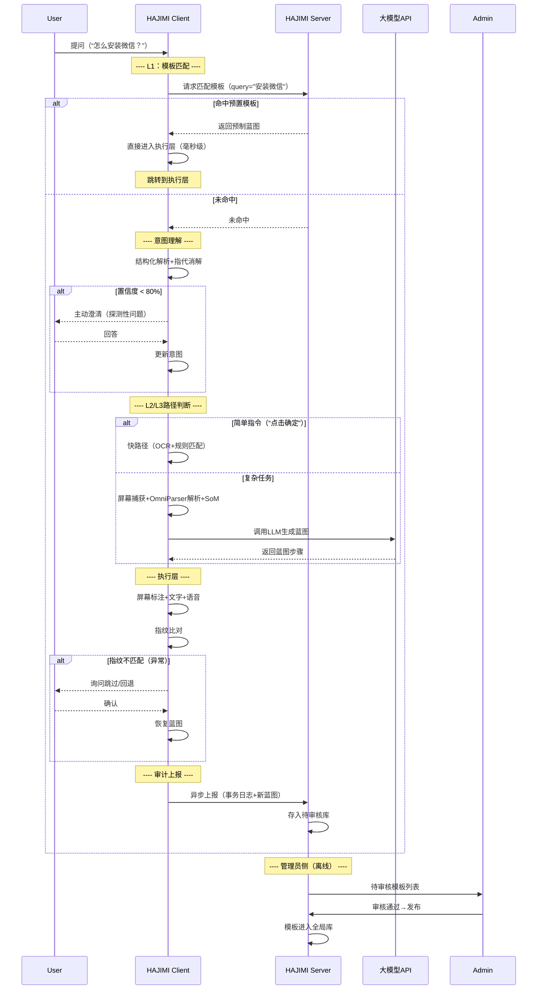

# HAJIMI — 智能桌面指引助手 完整设计文档V1

> **HAJIMI** = **H**elper **A**gent **J**ourney **I**ntelligent **M**emory **I**nteraction
>
> 日语中意为“初次/开始”——从这里开始，让复杂的电脑操作变得简单。


## 一、项目主题与定位

**项目名称**：HAJIMI — 智能桌面指引助手

**核心定位**：面向所有电脑用户（尤其新手、老年用户、视障用户）的桌面辅助程序。用户通过自然语言（文本/语音）提问，系统理解屏幕内容与用户意图后，给出清晰、安全、分步的操作指引，通过**屏幕标注（箭头/高亮/编号）、文字步骤、语音播报**三种方式同步输出，**仅提供指引，不直接操控电脑**。

**核心价值**：
- 降低电脑操作门槛，解决“不知道点哪里”“找不到功能”的困惑
- 提供实时、上下文感知的交互式帮助，无需切换窗口查教程
- 通过主动澄清机制确保准确理解用户需求
- 通过任务蓝图机制保证复杂操作的连续性与可靠性
- **C-S协同进化**：所有用户的操作经验可沉淀为模板，惠及后续用户


## 二、项目背景

### 2.1 现实痛点
- 电脑功能繁杂，新手用户常因界面复杂、图标含义不明、术语陌生而卡在基础操作上。
- 现有帮助文档（F1帮助、在线教程）是静态的、脱离上下文的，用户需要在“问题窗口”和“教程窗口”间反复切换，认知负担重。
- 视障及老年用户依赖屏幕朗读器，但朗读器仅能提取文字，无法理解图形界面的布局、图标语义和操作路径。
- 操作过程中的小偏差（点错按钮、多点了两步）往往导致任务失败，用户不知如何回退或纠正。
- 目前缺乏一套“越用越聪明”的桌面辅助系统——用户成功经验无法沉淀复用。

### 2.2 技术成熟度
- **多模态大模型**（GPT-4V、Qwen-VL、Claude 3.5 Sonnet）能够同时理解图像与文本，具备强大的视觉推理能力。
- **开源UI解析工具**（OmniParser V2、PaddleOCR）可精准提取屏幕上的可交互元素及其位置。
- **桌面GUI框架**（PyQt5）成熟稳定，支持透明覆盖层绘制，可实现屏幕标注。
- **语音交互**（ASR/TTS）已高度普及，离线方案和云端方案均可用。
- **Web前后端技术**（FastAPI、Vue/React）成熟，可快速构建管理员控制台。

### 2.3 项目意义
- 为计算机教育、无障碍辅助、企业培训、家庭技术支持提供新型交互工具。
- 填补“实时屏幕上下文 + 自然语言交互 + 群体知识沉淀”的桌面辅助空白。
- 技术综合性强（GUI开发、图像处理、AI推理、语音交互、前后端分离、数据库设计），适合作为实训项目。


## 三、建设目标

1. **智能感知**：实时捕获用户屏幕，精准识别所有可交互元素（按钮、输入框、图标、菜单等）。
2. **准确理解**：通过语义解析、指代消解、主动澄清三层机制，确保正确理解用户真实需求。
3. **稳定规划**：对复杂任务生成“任务蓝图”（恒定步骤序列），在执行过程中抵抗用户误操作和环境突变。
4. **多模态输出**：通过屏幕标注（箭头/高亮/编号）、文字步骤列表、语音播报三种方式同步反馈。
5. **快慢分流**：模板匹配（毫秒级）→ 快路径（<3秒）→ 慢路径（5~10秒），三级速度保障。
6. **群体进化**：所有客户端的成功经验可沉淀为服务端模板库，实现“一次学会，全域共享”。
7. **安全可控**：仅提供指引，不自动执行高风险操作；隐私数据脱敏后上报，原始截图不上传。


## 四、系统架构（四层 + C-S 拆分）

系统分为**客户端（HAJIMI Client）**和**服务端（HAJIMI Server）**。

- **客户端**：面向终端用户，负责实时交互、屏幕感知、本地推理与执行反馈，保证低延迟。
- **服务端**：面向管理员，负责数据持久化、跨客户端日志聚合、高频任务模板库管理、配置下发、系统健康监控。


### 4.1 整体架构图（文字描述）

```
┌─────────────────────────────────────────────────────────────────────────────┐
│                          HAJIMI Server（服务端）                           │
│  ┌─────────────────┐  ┌─────────────────┐  ┌─────────────────────────────┐ │
│  │   数据库持久化   │  │   管理员控制台   │  │   任务模板库 & 配置中心     │ │
│  │ （事务日志/模板）│  │   （Web UI）    │  │  （预置蓝图热部署/版本管理） │ │
│  └────────┬────────┘  └────────┬────────┘  └────────────┬────────────────┘ │
│           │                    │                        │                  │
│           └────────────────────┼────────────────────────┘                  │
│                                │ RESTful API / WebSocket                   │
└────────────────────────────────┼────────────────────────────────────────────┘
                                 │ HTTPS/WSS
┌────────────────────────────────┼────────────────────────────────────────────┐
│                                ▼                                           │
│  ┌─────────────────────────────────────────────────────────────────────────┐│
│  │                    HAJIMI Client（桌面端，多实例）                       ││
│  │  ┌──────────────┐  ┌──────────────────┐  ┌──────────┐  ┌─────────────┐││
│  │  │   感知层     │  │  理解与规划层    │  │  执行层  │  │  审计代理   │││
│  │  │（本地捕获/   │  │ （模板优先/      │  │（PyQt5   │  │（本地缓存/  │││
│  │  │  解析/SoM）  │  │  本地推理+云端） │  │ 覆盖层） │  │  异步上报） │││
│  │  └──────────────┘  └──────────────────┘  └──────────┘  └─────────────┘││
│  └─────────────────────────────────────────────────────────────────────────┘│
└─────────────────────────────────────────────────────────────────────────────┘
```


### 4.2 客户端：感知层（Perception Layer）

**职责**：将屏幕截图转化为结构化的UI元素数据。

#### 子模块：

**4.2.1 屏幕捕获（CAP）**
- 技术：`mss` 或 `PIL.ImageGrab`
- 功能：捕获全屏或当前活动窗口，适配高DPI缩放
- 触发时机：用户提问时立即捕获

**4.2.2 UI解析器（PARSER）**
- 首选方案：集成 **OmniParser V2**（开源），直接输出元素边界框、类型（按钮/输入框/图标/菜单等）、文本内容、置信度
- 备选方案（资源受限）：`PaddleOCR`（文字+坐标）+ `GroundingDINO`（目标检测），通过后处理合并
- 输出：元素列表 `[{id, bbox, type, text, confidence}, ...]`
- **缓存优化**：若窗口指纹（窗口句柄+标题哈希）未变，复用上一轮解析结果

**4.2.3 SoM标记生成器（SOM）**
- 在截图上为每个检测到的元素绘制彩色边界框和唯一数字ID（~1, ~2, ...）
- 输出：
  - **标注图**（用于LLM视觉输入）
  - **元素映射表**：`{id: {bbox, type, text, center_coord}}`


### 4.3 客户端：理解与规划层（Understanding & Planning Layer）

**这是系统的“大脑”，包含三个核心子模块。**

#### 4.3.1 意图理解模块（INTENT）

**职责**：确保“准确理解用户需求”，三层消歧机制。

**(1) 输入预处理与结构化**
- 剥离情绪词、冗余词，提取**核心目标**（动词+名词，如“安装微信”）和**约束条件**（如“不要装在C盘”）
- 意图分类：`操作指引类` / `信息查询类` / `异常处理类`

**(2) 指代消解与屏幕锚定**
- 若用户说“点这个”“选那个”，系统自动捕获**当前鼠标悬停位置**或**最后高亮/闪烁的元素**，将其作为指代对象
- 若无法确定指代对象，系统触发主动澄清

**(3) 置信度检测与主动澄清**
- 当系统对用户意图的理解置信度低于阈值（默认80%）时，生成二选一/多选一的探测性问题
- 示例：用户问“怎么保存”，系统反问：“您是想保存当前打开的Word文档，还是想下载网页上的这个文件？”
- 用户的澄清回答作为**新的事实锚点**，追加到轨迹层

#### 4.3.2 任务规划与蓝图管理模块（PLANNER）

**职责**：将用户需求转化为可执行的操作序列，复杂任务建立蓝图保护机制。

**三级速度保障（匹配优先级）**：

| 优先级 | 路径 | 触发条件 | 响应时间 | 说明 |
|--------|------|----------|----------|------|
| **L1（最快）** | 模板匹配 | 用户问题命中预置模板关键词 | **毫秒级** | Server下发预置蓝图，跳过LLM |
| **L2（快）** | 快路径 | 简单指令（如“点击确定”） | <3秒 | 本地OCR+规则匹配+轻量级LLM |
| **L3（标准）** | 慢路径 | 复杂任务/未命中模板/快路径失败 | 5~10秒 | 完整流程：OmniParser+多模态LLM+联网搜索 |

**蓝图生成与执行（L3专属）**：

1. **首轮生成**：调用LLM生成高层级主干步骤序列（Constant Steps），即“任务蓝图”
2. **锁定保存**：蓝图被保存在本地轨迹层，**后续所有子步骤基于此蓝图展开**
3. **状态机监控**：
   - 每一步执行后，系统比对**当前屏幕指纹**与**蓝图预期的下一阶段指纹**
   - 若匹配 → 推进蓝图
   - 若不匹配 → 蓝图进入“挂起”状态
4. **挂起与恢复**：
   - 系统主动向用户确认：“检测到屏幕状态与预期不符，您是跳过此步，还是退回蓝图第X步重试？”
   - 用户确认后，蓝图从挂起点恢复

**蓝图状态机**：
`蓝图生成` → `待确认` → `执行中` → `挂起（等待用户反馈）` → `回退` → `完成/终止`

#### 4.3.3 上下文记忆模块（MEMORY）

**职责**：管理多轮对话历史，防止上下文溢出，保存蓝图状态。

- **短期记忆**：保留最近3轮完整对话
- **蓝图记忆**：当前任务完整蓝图及执行进度
- **长期摘要**：Token超阈值（8k）时，LLM生成摘要替换旧历史
- **回退锚点**：蓝图各阶段的前置指纹哈希，供回退恢复


### 4.4 客户端：执行层（Execution Layer）

**职责**：将规划层输出的步骤转化为用户可感知的多模态反馈。

#### 4.4.1 屏幕标注渲染器（ANNO）
- 根据LLM输出的 `element_id`，查询映射表获取坐标
- 使用 **PyQt5透明覆盖层**（全屏、鼠标事件穿透）绘制：
  - **红色箭头**：从屏幕边缘指向目标元素
  - **红色虚线高亮框**：包围目标元素
  - **数字标签**：在目标元素旁显示ID

#### 4.4.2 文字指引显示（TEXT）
- 在桌面挂件的对话区显示结构化步骤列表
- 格式：`步骤 1: 点击标签 ~3 的“下载”按钮`
- 当前执行步骤高亮显示

#### 4.4.3 语音合成输出（TTS）
- 使用 `pyttsx3`（离线）或云端TTS API
- 用户可开关、调节语速


### 4.5 客户端：审计代理（Audit Agent）

**职责**：本地缓存事务数据，异步上报至服务端，不影响实时交互。

- **拦截字段**：事务ID、时间戳、用户意图摘要、步骤生成方式（模板/LLM/快路径）、执行结果、异常类型、用户反馈（点赞/点踩）
- **隐私保护**：
  - 不上传原始截图、个人文件名
  - 窗口标题仅保留类别（如“Word文档”）
  - 密码类输入自动替换为`[REDACTED]`
- **上报策略**：先写本地SQLite缓存，网络空闲或累积10条时批量POST


### 4.6 服务端：审计与优化层（Audit & Optimization Server）

#### 4.6.1 数据库设计（抽象表结构）

| 表名 | 字段 | 用途 |
|------|------|------|
| `t_transactions` | task_id, user_id, timestamp, intent, plan_type, result, duration | 事务主表 |
| `t_step_logs` | task_id, step_index, action, target_id, status, error_code | 步骤明细 |
| `t_failures` | failure_id, task_id, failure_type, fingerprint_hash, llm_snapshot | 异常明细 |
| `t_templates` | template_id, name, constant_steps_json, trigger_keywords, enabled, version | 任务模板库 |
| `t_feedback` | task_id, feedback_type（useful/useless）, comment | 用户反馈 |

#### 4.6.2 管理员角色与功能（Web控制台）

**管理员定位**：不是“监控者”，而是**“系统调参师”和“知识配方师”**。

| 功能模块 | 管理员操作 | 对客户端影响 |
|---------|-----------|-------------|
| **失败归因看板** | 查看高频失败任务TOP10，点击查看LLM推理快照和屏幕指纹（哈希） | 据此修改提示词或调整阈值 |
| **模板审核与发布** | 查看客户端上报的新蓝图（用户标记“有用”），审核后一键发布 | 其他客户端下次命中，毫秒级响应 |
| **配置热部署** | 修改置信度阈值、快慢路径规则、LLM端点、模板匹配关键词 | 客户端定期拉取新配置 |
| **系统健康监控** | 查看在线客户端数、平均响应时长、LLM API费用估算 | 辅助成本与性能评估 |
| **数据脱敏导出** | 导出脱敏日志用于离线分析 | 辅助项目报告 |

#### 4.6.3 C-S通信接口（抽象RESTful API）

| 接口 | Method | 方向 | 用途 |
|------|--------|------|------|
| `/api/templates/match` | POST | C→S | 根据用户问题匹配预置模板 |
| `/api/templates/list` | GET | C→S | 获取模板列表（管理界面） |
| `/api/audit/report` | POST | C→S | 批量上报审计日志 |
| `/api/config/pull` | GET | C→S | 拉取最新系统配置 |
| `/api/admin/stats` | GET | S→C | 管理员查看统计 |


## 五、核心工作流程（完整时序）




## 六、关键技术要点

### 6.1 三级速度保障机制

| 优先级 | 路径 | 技术手段 | 响应时间 |
|--------|------|----------|----------|
| L1 | 模板匹配 | 关键词匹配 + 预制蓝图 | 毫秒级 |
| L2 | 快路径 | OCR + 规则匹配 + 轻量LLM | <3秒 |
| L3 | 慢路径 | OmniParser + 多模态LLM + 联网搜索 | 5~10秒 |

### 6.2 准确理解用户需求（三重保障）

- **结构化解析**：剥离情绪词，提取核心目标（动词+名词）+ 约束条件
- **指代消解**：结合鼠标位置、屏幕焦点，将“这个”“那里”转化为具体元素ID
- **主动澄清**：置信度<80%时，生成二选一探测性问题

### 6.3 复杂任务蓝图保护机制

- **首轮规划**：生成Constant Steps并锁定
- **状态机监控**：每步验证屏幕指纹是否符合蓝图预期
- **挂起与恢复**：指纹不匹配时暂停，澄清后恢复，蓝图不被破坏
- **回退支持**：用户可主动退回蓝图任意已执行步骤

### 6.4 SoM标记法（坐标定位）

- 解析器检测元素并分配ID → 生成带ID标注图 → LLM输出引用ID → 查表得坐标
- 将LLM不擅长的“输出像素坐标”转化为擅长的“选择编号”

### 6.5 C-S协同进化

- **上报**：客户端执行完成后，将生成的蓝图（若用户反馈“有用”）上报服务端
- **审核**：管理员在Web控制台查看、审核、发布
- **分发**：其他客户端定期拉取新模板，实现“一次学会，全域共享”

### 6.6 上下文管理（防止溢出）

- 滑动窗口（最近3轮完整对话）
- 摘要压缩（Token超阈值时LLM生成摘要）
- 蓝图状态独立保存，不受对话历史影响


## 七、桌面挂件交互设计（UI/UX）

### 7.1 主界面（PyQt5）
- 悬浮于桌面，半透明毛玻璃，可拖拽置顶
- **输入区**：多行文本框 + 麦克风按钮（ASR转文字）
- **输出区**：对话气泡 + 步骤列表（当前步骤高亮）
- **状态指示器**：显示当前模式（模板/快/慢）、处理进度
- **控制栏**：语音播报开关、清空对话、回退按钮

### 7.2 屏幕覆盖层（Overlay）
- 独立全屏透明窗口，鼠标事件穿透
- 绘制红色箭头、红色虚线高亮框、白色底编号标签

### 7.3 语音交互
- **ASR**：`SpeechRecognition` + Google/百度API（或离线Vosk）
- **TTS**：`pyttsx3`（离线）或云端高音质引擎


## 八、技术选型

| 模块 | 推荐技术栈 | 备注 |
|------|-----------|------|
| **Client-桌面框架** | PyQt5 / PySide6 | 支持透明窗口 |
| **Client-屏幕捕获** | `mss` | 高性能，支持DPI缩放 |
| **Client-UI解析** | OmniParser V2（首选）/ PaddleOCR+GroundingDINO（备选） | 结构化元素输出 |
| **Client-图像处理** | OpenCV-Python | 质量评估（可选） |
| **Client-大模型** | GPT-4V / Qwen-VL-Max（云端）/ Qwen2-VL-7B（本地） | 按需选择 |
| **Client-联网搜索** | Tavily API / SerpAPI | Agent调用 |
| **Client-语音** | SpeechRecognition + pyttsx3 | ASR+TTS |
| **Server-Web框架** | FastAPI | 高性能异步，自动API文档 |
| **Server-数据库** | SQLite（初期）/ PostgreSQL（生产） | 事务日志+模板库 |
| **Server-缓存** | Redis（可选） | 客户端配置缓存 |
| **Server-管理面板** | Vue3 + Element-Plus / React + Ant Design | Web控制台 |
| **Server-部署** | Docker + Nginx | 容器化部署 |


## 九、团队分工（三人）

| 成员 | 主要负责 | 具体任务 |
|------|----------|----------|
| **A**（后端/AI核心） | Client端理解与规划层 + Server端核心 | 意图理解模块、蓝图规划逻辑、模板匹配接口、LLM/搜索API封装、数据库设计 |
| **B**（前端/桌面应用） | Client端感知/执行 + UI | 屏幕捕获、OmniParser封装、SoM标注、PyQt5桌面挂件、屏幕覆盖层、ASR/TTS集成 |
| **C**（系统集成/管理端） | 全流程集成 + Server端控制台 | 审计代理（异步上报）、配置拉取逻辑、Web管理面板、联调测试、项目文档 |


## 十、开发路线（两周）

| 阶段 | 天数 | 里程碑 |
|------|------|--------|
| **准备** | 1-2天 | 环境搭建、OmniParser/LLM API试用、FastAPI框架初始化 |
| **Client核心链路** | 3-5天 | 截图→解析→SoM→LLM→标注基础流程（不依赖Server） |
| **快慢模式** | 6-7天 | 实现L2快路径 + L3慢路径切换、简单指令规则匹配 |
| **Server雏形** | 7-8天 | 实现日志接收API、简单模板匹配接口、静态管理面板 |
| **蓝图机制** | 8-9天 | 实现复杂任务蓝图生成、状态机、指纹比对与挂起恢复 |
| **C-S联调** | 10-11天 | 审计上报、模板命中拉取、配置热更新全流程 |
| **完善与演示** | 12-14天 | UI细化、多场景测试、演示视频、项目报告 |


## 十一、风险与应对

| 风险 | 影响 | 应对措施 |
|------|------|----------|
| OmniParser显存占用高 | 运行卡顿 | 使用备选方案（PaddleOCR+GroundingDINO）；推理后释放显存 |
| LLM API调用延迟 | 用户等待时间长 | 三级速度保障（模板L1毫秒级兜底）；流式输出 |
| 模板匹配误命中 | 指引错误 | 模板匹配后仍需用户“确认使用模板”；管理员审核机制 |
| 蓝图的指纹预期不准 | 频繁挂起 | 初次蓝图生成后让用户确认“是否按此序列执行”；放宽指纹匹配容差 |
| 长对话上下文溢出 | 模型遗忘 | 摘要压缩；滑动窗口；蓝图状态独立保存 |
| Server宕机 | Client无法上报/拉取配置 | Client本地缓存优先；上报失败重试机制；不影响核心指引功能 |


## 十二、总结

HAJIMI 通过 **客户端-服务端协同架构** + **四级核心机制**，构建了一个可持续进化的桌面智能指引生态系统：

| 核心机制 | 解决的问题 | 实现层级 |
|----------|-----------|----------|
| **三级速度保障** | 响应延迟 | 模板（L1）→快路径（L2）→慢路径（L3） |
| **三重意图理解** | 准确理解用户需求 | 结构化解析 + 指代消解 + 主动澄清 |
| **蓝图状态机** | 复杂任务稳定性 | 首轮规划 + 指纹比对 + 挂起/恢复 + 回退 |
| **C-S协同进化** | 系统持续变好 | 审计上报 + 管理员审核 + 模板分发 + 配置热部署 |

**客户端**保障实时体验、隐私安全与本地推理；**服务端**实现知识沉淀、群体智能与系统可观测性；**管理员**通过Web控制台扮演“配方师”和“调参师”角色。这是一个既有技术深度（多模态LLM、状态机、前后端分离），又有实用价值（帮助真实用户解决操作困难），还有持续进化能力的完整系统设计。