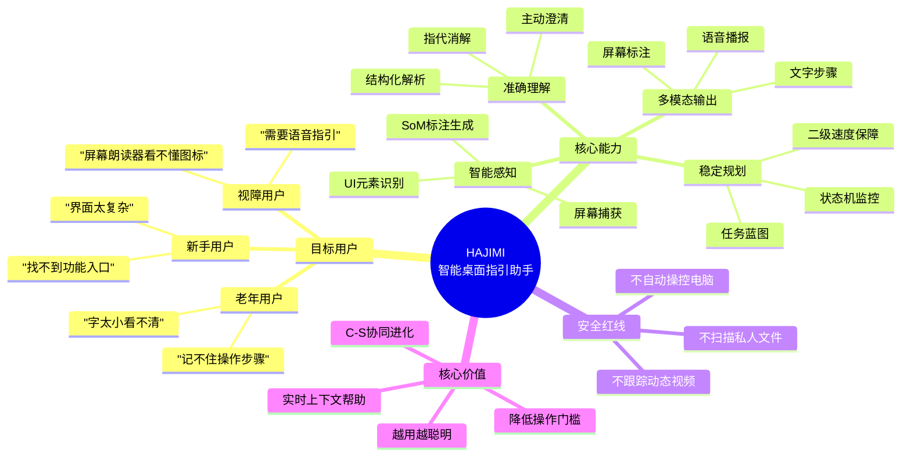
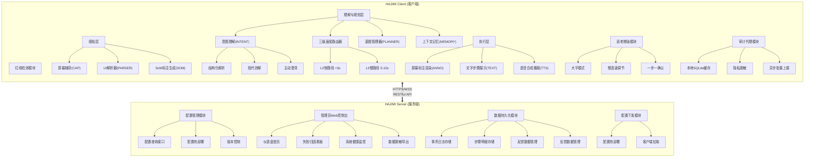
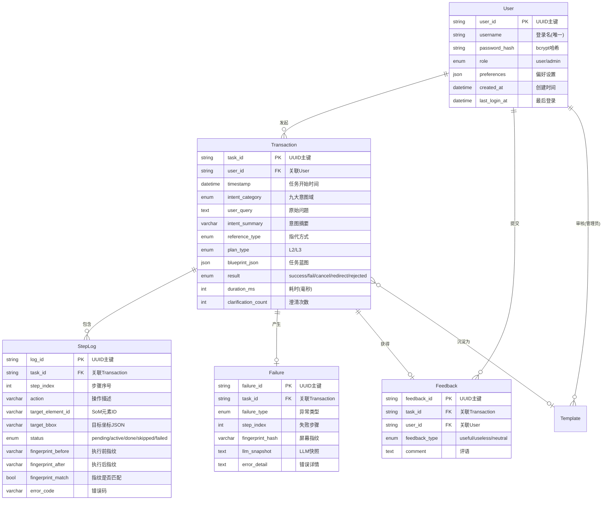
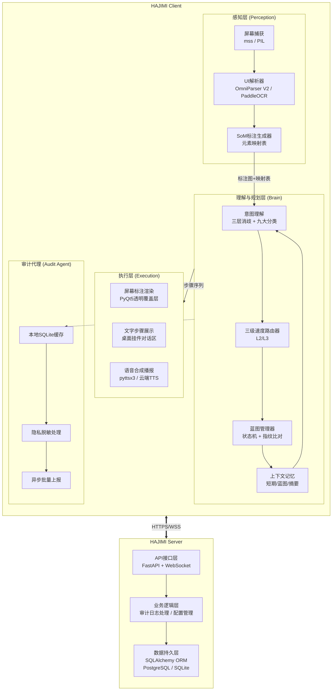
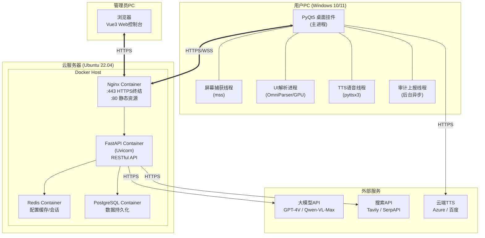
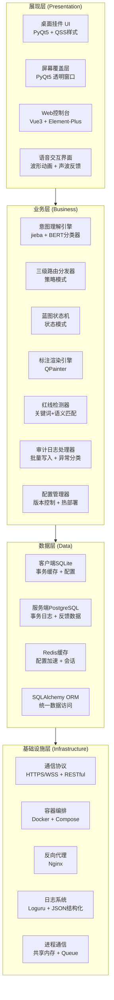
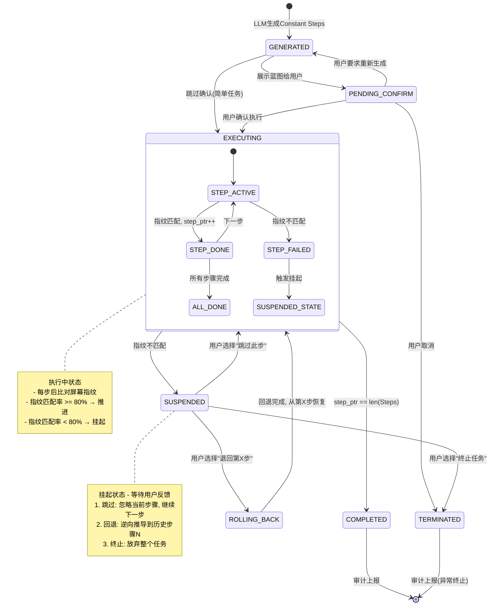
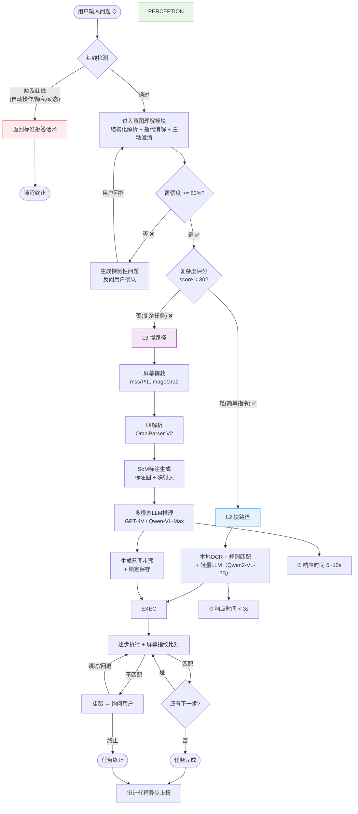
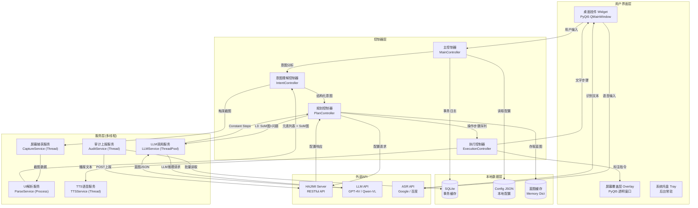
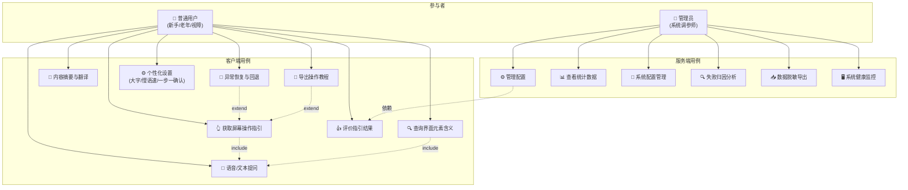

# HAJIMI — 智能桌面指引助手 概要设计 — 图表与UML描述

> 本文档配合 `HAJIMI_概要设计文档_V3.2.docx` 使用，提供所有架构图、流程图、ER图、部署图的Mermaid/PlantUML代码及文字描述。
> 所有图表均可直接渲染为图片后插入Word文档对应占位符位置。

---

## 目录

1. [图1 项目定位图](#图1-项目定位图)
2. [图2 核心业务时序图](#图2-核心业务时序图)
3. [图3 系统功能模块结构图](#图3-系统功能模块结构图)
4. [图4 E-R实体结构图](#图4-er实体结构图)
5. [图5 系统四层逻辑架构图](#图5-系统四层逻辑架构图)
6. [图6 网络部署架构图](#图6-网络部署架构图)
7. [图7 技术架构分层图](#图7-技术架构分层图)
8. [图8 桌面挂件主界面示意图](#图8-桌面挂件主界面示意图)
9. [图9 屏幕覆盖层标注示意图](#图9-屏幕覆盖层标注示意图)
10. [图10-14 Web控制台界面](#图10-14-web控制台界面)
11. [图15 蓝图状态机转换图](#图15-蓝图状态机转换图)
12. [图16 二级速度保障流程图](#图16-二级速度保障流程图)
13. [图17 意图理解三层消歧流程图](#图17-意图理解三层消歧流程图)
14. [图18 数据库物理模型图](#图18-数据库物理模型图)
15. [图19 客户端组件交互图](#图19-客户端组件交互图)
16. [图20 系统用例图](#图20-系统用例图)

---

## 图1 项目定位图

### 文字描述

一张展示HAJIMI系统核心定位与价值主张的概念图。

- **顶部**：标题"HAJIMI — 智能桌面指引助手"
- **左侧**：三类目标用户画像（新手用户、老年用户、视障用户）及其痛点
- **中间**：系统核心能力圈——屏幕感知 → 意图理解 → 任务规划 → 多模态输出
- **右侧**：三条红线边界（不操控/不窥私/不跟踪）
- **底部**：核心价值主张——降低操作门槛、实时上下文帮助、C-S协同进化

### Mermaid 代码 (Mindmap风格)



---

## 图2 核心业务时序图

### 文字描述

展示从用户提问到获得指引的完整系统交互时序，涵盖L2快路径（<3秒）和L3慢路径（全视觉推理，5~10秒）两条路径，以及异常挂起恢复、审计上报闭环。

### Mermaid 代码

```mermaid
sequenceDiagram
    actor User as 用户
    participant Widget as 桌面挂件
    participant Client as HAJIMI Client
    participant Server as HAJIMI Server
    participant LLM as 多模态大模型
    actor Admin as 管理员

    User->>Widget: 输入问题（文本/语音）
    Widget->>Client: 转发用户问题

    Note over Client: === 红线检测 ===
    alt 触及红线
        Client-->>Widget: 标准拒答/降级话术
        Widget-->>User: 显示安全提示
    else 通过红线检测
        Note over Client: === 意图理解 ===
        Client->>Client: 结构化解析 + 指代消解
        alt 置信度 < 80%
            Client-->>Widget: 主动澄清问题
            Widget-->>User: 显示探测性问题
            User->>Widget: 选择/回答
            Widget->>Client: 更新意图锚点
            end

            Note over Client: === L2/L3 路径判断 ===
            alt 简单指令 (L2)
                Client->>Client: OCR + 规则匹配 (<3s)
            else 复杂任务 (L3)
                Client->>Client: 屏幕捕获 + OmniParser + SoM
                Client->>LLM: 标注图 + 问题 + 约束
                LLM-->>Client: 返回Constant Steps蓝图 (5-10s)
                Client->>Client: 锁定蓝图 + 状态机初始化
            end
        end

        Note over Client,Widget: === 执行层 ===
        loop 逐步执行
            Client->>Widget: 屏幕标注(箭头/高亮/编号)
            Client->>Widget: 文字步骤(当前步骤高亮)
            Client->>Widget: TTS语音播报
            Client->>Client: 屏幕指纹比对
            alt 指纹不匹配
                Client-->>Widget: 挂起询问(跳过/回退/终止)
                Widget-->>User: 显示挂起对话框
                User->>Widget: 选择
                Widget->>Client: 恢复/回退/终止
            end
        end

        Note over Client,Server: === 审计上报 ===
        Client->>Server: POST /api/audit/report (异步批量)
    end
```

---

## 图3 系统功能模块结构图

### 文字描述

按"客户端-服务端"两大角色进行顶层划分，展示HAJIMI系统的完整功能模块层次结构。

### Mermaid 代码 (组织架构图风格)



---

## 图4 E-R实体结构图

### 文字描述

展示系统7个核心实体及其关系：User、Transaction、StepLog、Template、Feedback、Failure、SystemConfig。

### Mermaid 代码



---

## 图5 系统四层逻辑架构图

### 文字描述

展示客户端四层（感知层→理解规划层→执行层→审计代理）+ 服务端三层（API接口层→业务逻辑层→数据持久层）的完整逻辑架构，以及层间数据流向。

### Mermaid 代码



---

## 图6 网络部署架构图

### 文字描述

展示HAJIMI系统的完整物理部署拓扑：用户PC（运行客户端）、云服务器（运行服务端Docker集群）、第三方API服务、管理员浏览器。

### Mermaid 代码



---

## 图7 技术架构分层图

### 文字描述

展示系统的技术分层架构：展现层、业务层、数据层、基础设施层，以及各层使用的具体技术栈。

### Mermaid 代码



---

## 图8 桌面挂件主界面示意图

### 文字描述

HAJIMI桌面挂件的UI布局示意图。

**布局结构 (380×600px，半透明毛玻璃，圆角矩形):**

```
┌──────────────────────────────────┐
│  🟢 HAJIMI 智能指引           │ ← 状态栏 (30px)
│                         12:30     │
├──────────────────────────────────┤
│  ┌──────────────────────────┐    │
│  │  请输入您的问题，或点击   │    │
│  │  麦克风按钮说话…         │    │ ← 输入区 (80px)
│  │                          │    │
│  └──────────────────────────┘ 🎤 │
├──────────────────────────────────┤
│                                  │
│  ┌──────────────────────┐       │
│  │     用户消息气泡      │       │ ← 对话区
│  │     (蓝色, 右对齐)    │       │   (可滚动)
│  └──────────────────────┘       │
│         ┌──────────────────┐    │
│         │  系统回复气泡     │    │
│         │  (灰色, 左对齐)   │    │
│         └──────────────────┘    │
│  ┌────────────────────────┐     │
│  │ 📋 步骤列表            │     │
│  │ ✅ 步骤1: 点击~3「下载」│     │ ← 步骤卡片
│  │ 🟡 步骤2: 选择安装路径 │     │   (当前高亮)
│  │ ⬜ 步骤3: 点击「下一步」│     │
│  └────────────────────────┘     │
│                                  │
├──────────────────────────────────┤
│  🔊  🔤A+  ─⚪───   🗑️  ↩️  │ ← 控制栏 (40px)
│  语音  大字  语速   清空 回退    │
└──────────────────────────────────┘
```

### CSS/HTML 风格描述

```
桌面挂件:
  - 窗口类型: Qt.FramelessWindowHint | Qt.WindowStaysOnTopHint
  - 背景: rgba(255,255,255,0.85) + backdrop-filter: blur(20px)
  - 边框: 1px solid rgba(0,0,0,0.08); border-radius: 16px
  - 阴影: box-shadow: 0 8px 32px rgba(0,0,0,0.12)
  - 可拖拽区域: 顶部32px

状态指示器:
  - 在线: 绿色圆点(#4CAF50) + "HAJIMI 智能指引"
  - 模式标签: 圆角胶囊形背景
    - L2快速: 蓝色背景 "#快速响应"
    - L3深度: 紫色背景 "#深度推理"

输入区:
  - 文本框: 多行, min-height=60px, placeholder居中
  - 麦克风按钮: 圆形48px, 红色(#F44336)录音中, 灰色待机
  - 录音动画: 脉动波纹特效

对话气泡:
  - 用户消息: 蓝色(#2196F3)背景, 白色文字, border-radius: 12px 12px 4px 12px
  - 系统消息: 灰色(#F5F5F5)背景, 深色文字, border-radius: 12px 12px 12px 4px

步骤卡片:
  - 背景: #FAFAFA; border-left: 3px solid #FF9800(当前步骤)
  - 已完成步骤: border-left颜色转为#4CAF50, 文字灰色
  - 编号圆形: 24px直径, 已完成填绿色, 当前填橙色, 未开始灰色边框

控制栏:
  - 图标按钮: 32x32px, hover变色
  - 语速滑块: QSlider, 范围0.5-1.5, step=0.1
```

---

## 图9 屏幕覆盖层标注示意图

### 文字描述

展示HAJIMI在用户屏幕上绘制操作指引标注的视觉效果。

**标注示例场景：用户问"怎么保存这个文档？"**

```
桌面屏幕 (1920×1080)
┌──────────────────────────────────────────────────────────────┐
│                                                              │
│  ┌─────────────┐                                             │
│  │  文件(F)    │ ← 菜单栏                                    │
│  └─────────────┘                                             │
│                                                              │
│        ┌──────────────────────────┐                          │
│        │                          │                          │
│        │     文档编辑区域          │                          │
│        │                          │                          │
│        └──────────────────────────┘                          │
│                                                              │
│                                          ↑                   │
│                                          │                   │
│   ┌─────────────────────────┐    ┌──────┴──────┐            │
│   │                         │    │  ┌──────┐   │            │
│   │   快速访问工具栏         │    │  │  💾   │   │            │
│   │                         │    │  │ 保存  │   │            │
│   └─────────────────────────┘    │  └──────┘   │            │
│                                   │    ~3       │ ← 白底红字标签
│                                   └─────────────┘            │
│                                    ↑ 红色虚线高亮框           │
│                                                              │
│   红色箭头(从屏幕顶部边缘指向保存按钮)                          │
│                                                              │
│                                                              │
│  ┌──────────────────────────────┐                            │
│  │   状态栏                      │                            │
│  └──────────────────────────────┘                            │
│                                                              │
└──────────────────────────────────────────────────────────────┘

标注元素说明:
  - 红色箭头: QPainterPath, #FF0000, 线宽3px, 箭头头部填充
  - 红色虚线高亮框: QPen DashLine, #FF0000, 线宽2px, 四角缺口12px
  - 编号标签: 白底(#FFFFFF)圆角矩形 44×44px, 红色(#FF0000)文字 "~3", 16pt Bold
  - 所有元素位于透明覆盖层, 鼠标事件完全穿透(WA_TransparentForMouseEvents)
```

---

## 图10-14 Web控制台界面

### 文字描述

Web管理控制台(Vue3 + Element-Plus)的5个核心页面布局描述。

### 图10 — 登录页面

```
┌─────────────────────────────────────────┐
│                                         │
│         ┌───────────────────┐           │
│         │   HAJIMI Admin    │           │
│         │   管理控制台       │           │
│         │                   │           │
│         │  ┌─────────────┐  │           │
│         │  │  用户名      │  │           │
│         │  └─────────────┘  │           │
│         │  ┌─────────────┐  │           │
│         │  │  密码        │  │           │
│         │  └─────────────┘  │           │
│         │  [ 记住密码 ]     │           │
│         │  ┌─────────────┐  │           │
│         │  │    登  录    │  │           │
│         │  └─────────────┘  │           │
│         └───────────────────┘           │
│                                         │
└─────────────────────────────────────────┘
  居中卡片: 400×450px, 圆角8px, 投影
  左侧: HAJIMI品牌色装饰条
```

### 图11 — 仪表盘首页

```
┌──────────────────────────────────────────────┐
│  🏠 仪表盘    ⚙️ 配置  📊 归因  │ ← 侧边导航
├──────────────────────────────────────────────┤
│  统计卡片行:                                   │
│  ┌──────┐ ┌──────┐ ┌──────┐ ┌──────┐        │
│  │1,247 │ │  42  │ │ 89%  │ │ $3.2 │        │
│  │今日事 │ │在线客│ │有用率│ │API费 │        │
│  │务量  │ │户端  │ │      │ │用预估│        │
│  └──────┘ └──────┘ └──────┘ └──────┘        │
│                                              │
│  ┌─────────────────┐  ┌──────────────────┐   │
│  │  L2/L3比例   │  │  24h响应时长趋势 │   │
│  │    饼图         │  │    折线图         │   │
│  └─────────────────┘  └──────────────────┘   │
│                                              │
│  ┌──────────────────────────────────────┐     │
│  │  高频任务 TOP10 柱状图                │     │
│  └──────────────────────────────────────┘     │
└──────────────────────────────────────────────┘
```

### 图12 — 系统配置页

```
┌──────────────────────────────────────────────┐
│  系统配置页                                   │
├──────────────────────────────────────────────┤
│                                              │
│  置信度阈值: [========|========] 80%         │
│  最大蓝图步骤数: [========|====] 15          │
│  LLM API 端点: [https://api.openai.com/v1]   │
│  LLM 模型: [gpt-4o]                          │
│  Token 限制: [====|============] 8000        │
│  配置轮询间隔: [====|============] 30min     │
│  审计批量大小: [===|=============] 10        │
│  离线TTS引擎: [pyttsx3]                      │
│                                              │
│  [恢复默认] [热部署]                          │
└──────────────────────────────────────────────┘
```

### 图13 — 失败归因详情

```
┌──────────────────────────────────────────────┐
│  失败归因分析                                 │
├──────────────────────────────────────────────┤
│  ┌──────────────────────────────────────┐    │
│  │  高频失败TOP10                       │    │
│  │  ████████████ 蓝图不匹配    42次     │    │
│  │  ██████ LLM超时            18次     │    │
│  │  ████ 解析错误             12次     │    │
│  │  ██ 用户中止               8次      │    │
│  └──────────────────────────────────────┘    │
│                                              │
│  详情展开:                                    │
│  ┌──────────────────────────────────────┐    │
│  │ Task #a3f2: "安装微信" - L3          │    │
│  │ 失败步骤: Step 2                      │    │
│  │ 预期指纹: SHA256(Word文档 + button)   │    │
│  │ 实际指纹: SHA256(Chrome + download)   │    │
│  │ LLM输入快照: [展开查看]               │    │
│  │ LLM输出快照: [展开查看]               │    │
│  └──────────────────────────────────────┘    │
└──────────────────────────────────────────────┘
```

### 图14 — 系统配置页

```
┌──────────────────────────────────────────────┐
│  系统配置                                     │
├──────────────────────────────────────────────┤
│  ┌──────────────────────────────────────┐    │
│  │ 置信度阈值: [========|========] 80%   │    │
│  │ LLM端点: [https://api.openai.com/v1]  │    │
│  │ LLM模型: [gpt-4-vision-preview  ▼]    │    │
│  │ 最大蓝图步骤数: [15]                   │    │
│  │ Token超限阈值: [8000]                  │    │
│  │ 客户端配置拉取间隔: [30] 分钟          │    │
│  │ 审计上报批量大小: [10] 条              │    │
│  │ 离线TTS引擎: [pyttsx3  ▼]             │    │
│  │                                       │    │
│  │ [恢复默认] [热部署 >>]                 │    │
│  └──────────────────────────────────────┘    │
└──────────────────────────────────────────────┘
```

---

## 图15 蓝图状态机转换图

### 文字描述

任务蓝图(Blueprint)的完整状态机转换图，展示从生成到完成/终止的所有合法状态转换路径。

### Mermaid 代码



---

## 图16 二级速度保障流程图

### 文字描述

展示从用户问题输入到选择L2/L3处理路径的完整决策流程。

### Mermaid 代码



---

## 图17 意图理解三层消歧流程图

### 文字描述

展示HAJIMI意图理解模块的三层递进消歧机制：结构化解析→指代消解→主动澄清。

### Mermaid 代码

```mermaid
flowchart TD
    INPUT([用户问题: "那个圆圆的像齿轮的东西怎么点"])
    
    subgraph LAYER1["第一层: 结构化解析"]
        A1["剥离情绪词/冗余词<br/>'怎么点'"]
        A2["提取核心目标<br/>动词: 点击 | 名词: 齿轮状元素"]
        A3["提取约束条件<br/>约束: 圆形的"]
        A4["九大意图域分类<br/>→ 界面元素认知(二类)"]
        A1 --> A2 --> A3 --> A4
    end
    
    subgraph LAYER2["第二层: 指代消解"]
        B1{"指代方式判断"}
        B1 -->|"显式命名"| B2["OCR文本匹配<br/>精准定位"]
        B1 -->|"视觉位置"| B3["bbox空间推理<br/>区域搜索"]
        B1 -->|"指示代词<br/>(这个/那个)"| B4["捕获鼠标坐标<br/>映射最近SoM元素"]
        B1 -->|"模糊描述<br/>(圆圆的/齿轮)"| B5["多模态LLM<br/>视觉语义匹配"]
        B1 -->|"上下文接力"| B6["映射前一轮<br/>输出的元素ID"]
        
        B5 --> B7["返回Top 3候选<br/>~12(设置) ~27(工具) ~35(选项)"]
    end
    
    subgraph LAYER3["第三层: 置信度检测"]
        C1["综合置信度计算<br/>分类概率×0.4 + 匹配确定性×0.4 + 上下文一致性×0.2"]
        C2{"置信度 >= 80%?"}
        C3["直接输出意图结果<br/>target: ~12, action: 点击"]
        C4["生成探测性问题<br/>'您指的是~12(设置图标)、<br/>~27(工具图标)还是~35(选项图标)?'"]
        C5["用户选择 → 追加锚点<br/>更新target为确认的元素ID"]
    end
    
    INPUT --> LAYER1
    LAYER1 --> LAYER2
    LAYER2 --> LAYER3
    C2 -->|"是 ✅"| C3
    C2 -->|"否 ❌"| C4 --> C5 --> C3
    C3 --> OUTPUT([输出: 意图=界面元素认知<br/>目标=~12, 操作=点击])
```

---

## 图18 数据库物理模型图

### 文字描述

展示7个核心数据表的完整物理模型，包含所有字段、数据类型、约束、索引和表间外键关系。

### SQL DDL (可直接执行)

```sql
-- ============================================
-- HAJIMI 数据库物理模型 DDL
-- 目标: PostgreSQL 14+
-- ============================================

-- 1. 用户表
CREATE TABLE t_users (
    user_id         VARCHAR(64)  PRIMARY KEY,
    username        VARCHAR(128) NOT NULL UNIQUE,
    password_hash   VARCHAR(256) NOT NULL,
    role            VARCHAR(16)  NOT NULL DEFAULT 'user'
                    CHECK (role IN ('user', 'admin')),
    preferences     JSONB        DEFAULT '{}',
    created_at      TIMESTAMP    NOT NULL DEFAULT CURRENT_TIMESTAMP,
    last_login_at   TIMESTAMP
);
CREATE INDEX idx_users_username ON t_users(username);
CREATE INDEX idx_users_role ON t_users(role);

-- 2. 事务记录表
CREATE TABLE t_transactions (
    task_id             VARCHAR(64)  PRIMARY KEY,
    user_id             VARCHAR(64)  NOT NULL REFERENCES t_users(user_id),
    timestamp           TIMESTAMP    NOT NULL DEFAULT CURRENT_TIMESTAMP,
    intent_category     VARCHAR(32)  NOT NULL
                        CHECK (intent_category IN (
                            '操作指引', '元素认知', '异常诊断',
                            '界面导航', '内容认知', '资产管理',
                            '状态监控', '流程复盘', '情感陪伴'
                        )),
    user_query          TEXT         NOT NULL,
    intent_summary      VARCHAR(512),
    reference_type      VARCHAR(16)
                        CHECK (reference_type IN (
                            '显式命名', '视觉位置', '指示代词',
                            '模糊描述', '上下文接力'
                        )),
    plan_type           VARCHAR(4)   NOT NULL
                        CHECK (plan_type IN ('L2', 'L3')),
    blueprint_json      JSONB,
    result              VARCHAR(16)  NOT NULL DEFAULT 'success'
                        CHECK (result IN ('success', 'fail', 'cancel', 'redirect', 'rejected')),
    duration_ms         INTEGER      NOT NULL DEFAULT 0,
    clarification_count INTEGER      NOT NULL DEFAULT 0
);
CREATE INDEX idx_trans_user_id ON t_transactions(user_id);
CREATE INDEX idx_trans_timestamp ON t_transactions(timestamp DESC);
CREATE INDEX idx_trans_plan_type ON t_transactions(plan_type);
CREATE INDEX idx_trans_result ON t_transactions(result);

-- 3. 步骤日志表
CREATE TABLE t_step_logs (
    log_id              VARCHAR(64)  PRIMARY KEY,
    task_id             VARCHAR(64)  NOT NULL REFERENCES t_transactions(task_id),
    step_index          INTEGER      NOT NULL CHECK (step_index >= 1),
    action              VARCHAR(512) NOT NULL,
    target_element_id   VARCHAR(16),
    target_bbox         VARCHAR(64),
    status              VARCHAR(16)  NOT NULL DEFAULT 'pending'
                        CHECK (status IN (
                            'pending', 'active', 'done', 'skipped', 'failed'
                        )),
    fingerprint_before  VARCHAR(128),
    fingerprint_after   VARCHAR(128),
    fingerprint_match   BOOLEAN,
    error_code          VARCHAR(32),
    UNIQUE (task_id, step_index)
);
CREATE INDEX idx_steps_task_id ON t_step_logs(task_id);
CREATE INDEX idx_steps_status ON t_step_logs(status);

-- 4. 用户反馈表
CREATE TABLE t_feedback (
    feedback_id     VARCHAR(64)  PRIMARY KEY,
    task_id         VARCHAR(64)  NOT NULL REFERENCES t_transactions(task_id),
    user_id         VARCHAR(64)  NOT NULL REFERENCES t_users(user_id),
    feedback_type   VARCHAR(16)  NOT NULL
                    CHECK (feedback_type IN ('useful', 'useless', 'neutral')),
    comment         TEXT,
    created_at      TIMESTAMP    NOT NULL DEFAULT CURRENT_TIMESTAMP,
    UNIQUE (task_id, user_id)
);
CREATE INDEX idx_fb_task_id ON t_feedback(task_id);
CREATE INDEX idx_fb_type ON t_feedback(feedback_type);

-- 6. 异常记录表
CREATE TABLE t_failures (
    failure_id      VARCHAR(64)  PRIMARY KEY,
    task_id         VARCHAR(64)  NOT NULL REFERENCES t_transactions(task_id),
    failure_type    VARCHAR(32)  NOT NULL
                    CHECK (failure_type IN (
                        'blueprint_mismatch', 'llm_timeout',
                        'parse_error', 'user_abort',
                        'redline_blocked', 'other'
                    )),
    step_index      INTEGER,
    fingerprint_hash VARCHAR(128),
    llm_snapshot    TEXT,
    error_detail    TEXT,
    created_at      TIMESTAMP    NOT NULL DEFAULT CURRENT_TIMESTAMP
);
CREATE INDEX idx_fail_task_id ON t_failures(task_id);
CREATE INDEX idx_fail_type ON t_failures(failure_type);

-- 7. 系统配置表
CREATE TABLE t_system_configs (
    config_id       VARCHAR(64)  PRIMARY KEY,
    config_key      VARCHAR(128) NOT NULL UNIQUE,
    config_value    TEXT         NOT NULL,
    description     VARCHAR(512),
    updated_by      VARCHAR(64)  REFERENCES t_users(user_id),
    updated_at      TIMESTAMP    NOT NULL DEFAULT CURRENT_TIMESTAMP
);
CREATE INDEX idx_cfg_key ON t_system_configs(config_key);
```

---

## 图19 客户端组件交互图

### 文字描述

展示HAJIMI Client内部各组件之间的数据流和调用关系。

### Mermaid 代码



---

## 图20 系统用例图

### 文字描述

展示HAJIMI系统的完整用例图，包含普通用户和管理员两类参与者及其用例关系。

### Mermaid 代码



---

## 附录：图表与Word文档占位符对照表

| Word中的占位符 | 对应图表编号 | 图表标题 | 建议渲染尺寸 |
|---------------|------------|---------|------------|
| `【此处插入 图1 HAJIMI智能桌面指引助手系统项目定位图】` | 图1 | 项目定位图 | 16:9宽幅 |
| `【此处插入 图2 用户提问到获得指引的完整时序图】` | 图2 | 核心业务时序图 | A4纵向 |
| `【此处插入 图3 系统功能模块结构图】` | 图3 | 系统功能模块结构图 | A4横向 |
| `【此处插入 图4 E-R实体结构图】` | 图4 | E-R实体结构图 | A4横向 |
| `【此处插入 图5 系统四层逻辑架构图】` | 图5 | 系统四层逻辑架构图 | A4横向 |
| `【此处插入 图6 网络部署架构图】` | 图6 | 网络部署架构图 | A4横向 |
| `【此处插入 图7 技术架构分层图】` | 图7 | 技术架构分层图 | A4纵向 |
| `【此处插入 图8 桌面挂件主界面示意图】` | 图8 | 桌面挂件主界面示意图 | 16:9 |
| `【此处插入 图9 屏幕覆盖层标注示意图】` | 图9 | 屏幕覆盖层标注示意图 | 16:9宽幅 |
| `【此处插入 图10 Web控制台登录界面】` | 图10 | 登录页面 | 4:3 |
| `【此处插入 图11 Web控制台仪表盘首页】` | 图11 | 仪表盘首页 | 16:9 |
| `【此处插入 图12 Web控制台系统配置页界面】` | 图12 | 系统配置页 | 16:9 |
| `【此处插入 图13 Web控制台失败归因详情界面】` | 图13 | 失败归因详情 | 16:9 |
| `【此处插入 图14 Web控制台系统配置界面】` | 图14 | 系统配置页 | 16:9 |
| `【此处插入 图15 蓝图状态机转换图】` | 图15 | 蓝图状态机转换图 | A4纵向 |
| `【此处插入 图16 二级速度保障流程图】` | 图16 | 二级速度保障流程图 | A4纵向 |
| `【此处插入 图17 意图理解三层消歧流程图】` | 图17 | 意图理解三层消歧流程图 | A4纵向 |
| `【此处插入 图18 数据库物理模型图】` | 图18 | 数据库物理模型图 | A4横向 |
| `【此处插入 图19 客户端组件交互图】` | 图19 | 客户端组件交互图 | A4横向 |
| `【此处插入 图20 系统用例图】` | 图20 | 系统用例图 | A4横向 |

---

> **渲染建议**: 所有Mermaid代码可使用 [Mermaid Live Editor](https://mermaid.live/) 在线渲染为PNG/SVG，或使用 `mermaid-cli` 命令行工具批量导出。PlantUML代码可使用PlantUML Server或VS Code插件渲染。建议导出为300dpi PNG以保证Word文档中的显示质量。
