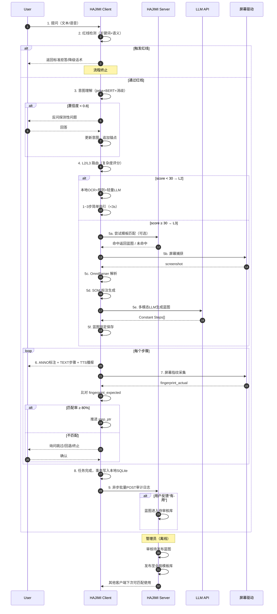

# HAJIMI 智能桌面指引助手 —— 详细算法与项目流程说明文档（汇报版）

> **文档版本**：V1.0（汇报稿）
> **适用对象**：项目指导老师、评审专家
> **文档定位**：在《HAJIMI 概要设计文档 V3.7》与《HAJIMI 完整设计文档 V2》的基础上，对项目涉及的**核心算法底层原理、端到端流程、关键实现细节**进行系统性、可汇报化的阐述。
> **编写原则**：学术严谨、逻辑清晰、图表结合、公式可核。

---

## 〇、汇报提要

本汇报围绕 HAJIMI 系统展开，依次回答五个层面的问题：

1. **算法层**：系统依赖的两个"看得见"的核心算法（OmniParser、Set-of-Mark）究竟在做什么、为什么有效；
2. **交互层**：用户的自然语言输入如何与图形界面（GUI）"对得上话"——即输入输出配合机制；
3. **流程层**：从用户提问到屏幕标注输出的端到端链路如何运转；
4. **决策层**：意图理解与任务蓝图规划的具体算法实现步骤；
5. **架构层**：整个项目的算法体系如何组织、各算法之间如何协同。

为便于评审，全文采用"**原理 → 公式/伪代码 → 在 HAJIMI 中的落地**"三段式叙述。

---

## 一、项目回顾与汇报切入点

### 1.1 项目一句话定义

**HAJIMI（Helper Agent Journey Intelligent Memory Interaction）** 是一款面向普通电脑用户（尤其新手、老年及视障用户）的桌面辅助程序。其核心特征是 **"看屏 + 听话 + 指路"**：

- **看屏**：自动理解当前屏幕界面的可交互元素（按钮、输入框、图标……）；
- **听话**：接受用户的自然语言（文本或语音）提问；
- **指路**：在用户屏幕上以**红色箭头 + 虚线高亮框 + 数字编号标签**的形式标注目标位置，配合**文字步骤列表**和**TTS 语音播报**，引导用户一步步完成操作。

> 系统只"指路"，**绝不替用户操作**。这是项目最核心的安全约束。

### 1.2 为什么要用"算法"作为汇报主线

HAJIMI 并不是一个普通 GUI 程序，而是一个**多算法协同的多模态系统**。一个完整的指引过程涉及：

| 任务 | 涉及算法 |
|------|---------|
| 看到屏幕里的按钮 | UI 元素检测（OmniParser） |
| 把按钮"指给"大模型 | 视觉标注（Set-of-Mark / SoM） |
| 听懂用户问什么 | 文本结构化解析 + BERT 意图分类 |
| 理解"这个""那个" | 五种指代消解 |
| 把任务拆成步骤 | 多模态 LLM 任务规划 |
| 知道做对没做对 | 屏幕指纹比对 + 状态机 |
| 让系统越用越聪明 | C-S 协同进化（模板审核-发布） |

下文将逐项展开。

---

## 二、核心算法底层原理深度解析

### 2.1 OmniParser —— 屏幕 UI 元素的"眼睛"

#### 2.1.1 算法的研究背景与定位

OmniParser 是由 Microsoft Research 在 2024 年提出并开源（GitHub: `microsoft/OmniParser`）的**通用屏幕 UI 解析模型**。其研究动机是：

> 现有的多模态大模型（如 GPT-4V）在"看见屏幕"上能力很强，但在"理解屏幕中**哪一个区域是可交互元素**"上表现欠佳。

OmniParser 的解决方案是：**把"识别像素区域"与"理解区域语义"两件事拆开做**。先用一个专用检测器把所有可交互控件抠出来，再用一个描述模型给每个控件打上"是什么"的文字标签。这样，下游 LLM 拿到的就不再是一整张模糊的截图，而是一份**带坐标、带类型、带文字的"UI 元素清单"**。

#### 2.1.2 算法整体架构（两阶段流水线）

OmniParser 的标准推理流程为**两阶段级联**：

```
输入: 屏幕截图 S (H × W × 3 RGB)
         │
         ▼
   ┌─────────────────────────────────────────────┐
   │  阶段 1: UI 元素检测 (Icon Detection)       │
   │  模型: YOLOv8 (Ultralytics)                │
   │  输出: N 个边界框 {bbox_i = (x1,y1,x2,y2)}  │
   │       + 类别 c_i ∈ {button, input, icon,  │
   │       menu, checkbox, dropdown, text, …}   │
   └─────────────────────────────────────────────┘
         │
         ▼  对每个 bbox 裁剪子图 S_i
         │
   ┌─────────────────────────────────────────────┐
   │  阶段 2: 元素语义描述 (Icon Description)    │
   │  模型: BLIP-2 / Florence-2 / MoE-LLaVA     │
   │  输出: 文字描述 t_i，如 "Save", "Login"   │
   └─────────────────────────────────────────────┘
         │
         ▼
   统一元素列表: E = {(bbox_i, c_i, t_i, conf_i)}
```

#### 2.1.3 关键子模型细节

| 子模型 | 任务 | 关键设计 | 推理成本 |
|--------|------|---------|---------|
| **YOLOv8s/m**（Icon Detection） | 检测控件位置 + 类型 | 训练集 67k 屏幕截图，覆盖 Windows / macOS / Web / Android；引入合成数据（HTML+CSS 渲染）解决真实标注稀缺 | 单张 1080p 截图 ~200ms（RTX 3060） |
| **Florence-2 / BLIP-2**（Icon Description） | 为小图标生成文字标签 | Florence-2 是微软的"基础视觉模型"，对图标 fine-tune 后 F1 显著高于 BLIP-2 | 单图 ~80ms |
| **可选 OCR 融合** | 把文字块作为"伪元素"补回 | 解决"纯文字按钮"被 YOLO 漏检的问题 | 100ms |

#### 2.1.4 OmniParser 在 HAJIMI 中的落地

在 HAJIMI 感知层（PARSER）中，OmniParser 作为**首选 UI 解析器**，工程化使用方式如下：

```python
# 伪代码：HAJIMI 感知层 PARSER 模块
def parse_screen(screenshot_pil: Image.Image) -> list[UIElement]:
    # 1. 调用 OmniParser V2 本地服务（HTTP 或子进程）
    raw_elements = omniparser_client.parse(
        image=screenshot_pil,
        conf_threshold=0.35,   # 置信度阈值，过低噪点
        iou_threshold=0.45,    # NMS 阈值，去重
    )
    # 2. 后处理：统一字段、补 bbox 中心点、规范化类别
    elements = []
    for i, e in enumerate(raw_elements):
        x1, y1, x2, y2 = e['bbox']
        elements.append(UIElement(
            id          = f"e{i+1}",
            bbox        = (x1, y1, x2, y2),
            center      = ((x1+x2)//2, (y1+y2)//2),
            type        = normalize_type(e['type']),
            text        = e.get('text', ''),
            confidence  = e['confidence'],
        ))
    return elements
```

**关键工程优化**：

1. **窗口指纹缓存**：当 `(窗口句柄 + 标题 + 前景进程)` 哈希未变化时，**直接复用上一轮的解析结果**，避免每步重新调用 OmniParser（一次解析 0.3s 是 L3 流程中较大的开销）；
2. **DPI 适配**：Windows 高 DPI 缩放下，截图坐标与物理坐标不一致，HAJIMI 通过 `SetProcessDpiAwareness` + 后端坐标变换统一；
3. **GPU 显存隔离**：OmniParser 跑在独立子进程里，推理结束后立即释放显存，避免污染主 GUI 进程；
4. **降级方案**：在无独显的低配机器上，自动切换为 `PaddleOCR + GroundingDINO` 组合，准确率略低但纯 CPU 可跑。

#### 2.1.5 OmniParser 的局限性

需要客观指出 OmniParser 的不足（这是汇报中**学术诚实**的体现）：

- **显存占用高**：≥8GB，否则需要量化或降级；
- **非标准控件识别弱**：游戏画面、自绘 GUI、Canvas 渲染的界面识别率明显下降；
- **语言偏英文**：对中文按钮描述稍弱，需要 OCR 融合；
- **速度**：单张截图 ~300ms，对 L3 流程的总时延（5~10s）有较大贡献。

HAJIMI 通过**窗口指纹缓存 + 二级速度路由（L2 不走 OmniParser）**双手段对冲这一不足。

---

### 2.2 Set-of-Mark（SoM）视觉标注 —— 把屏幕"读"给 LLM 听

#### 2.2.1 算法的研究背景

Set-of-Mark Prompting 由 Microsoft Research 的**付智、姚班团队**等人在 2023 年提出，2024 年发表于 **COLM 2024**（论文 *Set-of-Mark Visual Prompting for GPT-4V*）。其核心问题被他们一句话概括：

> **"GPT-4V is great at choosing, bad at counting pixels."**
> 多模态大模型在"选哪个"任务上很强（准确率 >90%），但在"输出像素坐标"任务上很弱（准确率 ~40%）。

SoM 的解法极其优雅：**不让模型输出坐标，让模型输出"编号"**。

#### 2.2.2 算法原理

把一张图片划分成若干"标记区域"（Set of Marks），每个区域有一个**唯一的可视编号/符号**。给模型的不是"请指出按钮的精确坐标"，而是"请选择按钮 ~3 的标签"。

```
原始截图 S          SoM 标注图 I_som         模型任务
┌──────────┐        ┌──────────┐            ┌──────────┐
│ [保存]   │  ───►  │ [~3保存] │   ───►     │ 选择 ~3  │
│ [打开]   │        │ [~5打开] │            │          │
└──────────┘        └──────────┘            └──────────┘
```

**关键实验结论**（论文数据）：

| 任务 | 无 SoM | 加 SoM |
|------|--------|--------|
| 屏幕 UI 元素定位准确率 | ~40% | **~95%** |
| 区域指代准确率（"点这个"） | ~55% | **~91%** |
| 视觉推理多选题 | ~68% | **~92%** |

#### 2.2.3 HAJIMI 对 SoM 的工程化实现

HAJIMI 在感知层（SOM 模块）实现了一个**工业级 SoM 生成器**：

```python
# 伪代码：HAJIMI SOM 标注生成
def generate_som(screenshot: Image, elements: list[UIElement]) -> tuple[Image, dict]:
    canvas = screenshot.copy()
    drawer = ImageDraw.Draw(canvas)
    font   = load_font(size=16, bold=True)

    # 元素类型 → 颜色映射
    TYPE_COLOR = {
        'button':   '#1E88E5',  # 蓝
        'input':    '#43A047',  # 绿
        'icon':     '#FDD835',  # 黄
        'menu':     '#8E24AA',  # 紫
        'checkbox': '#FB8C00',  # 橙
        'dropdown': '#00ACC1',  # 青
        'text':     '#757575',  # 灰
    }

    mapping = {}  # id -> {bbox, type, text, center}
    for idx, e in enumerate(elements, start=1):
        eid = f"~{idx}"
        color = TYPE_COLOR.get(e.type, '#FF0000')
        x1, y1, x2, y2 = e.bbox

        # 1) 画彩色边界框
        drawer.rectangle([x1, y1, x2, y2], outline=color, width=3)

        # 2) 在元素正上方贴编号标签
        label_w, label_h = 44, 30
        label_x = max(0, (x1+x2)//2 - label_w//2)
        label_y = max(0, y1 - label_h - 4)
        drawer.rounded_rectangle(
            [label_x, label_y, label_x+label_w, label_y+label_h],
            radius=4, fill='white', outline=color, width=2
        )
        draw_centered_text(drawer, eid, label_x, label_y, label_w, label_h, font, color)

        mapping[eid] = {
            'bbox':   e.bbox,
            'type':   e.type,
            'text':   e.text,
            'center': e.center,
        }

    # 输出: Base64 编码（用于送入多模态 LLM）+ 映射表（用于坐标反查）
    return encode_pil_to_base64(canvas), mapping
```

#### 2.2.4 SoM 在 HAJIMI 全流程中的枢纽作用

SoM 标记的**element_id** 实际上成为整个系统的"**中枢锚点**"——LLM 看到的、输出的、ANNO 渲染的、Audit 上报的，全都围绕这个编号展开：

```
    ┌─────────────┐
    │ OmniParser  │  → 元素列表 E（带 bbox）
    └──────┬──────┘
           ▼
    ┌─────────────┐
    │ SOM 生成器  │  → 标注图 I_som + 映射表 Map{id→bbox}
    └──────┬──────┘
           ▼
   ┌────────────────┐
   │ 多模态 LLM     │  → 任务蓝图 Steps[].target_element_id="~3"
   └────────┬───────┘
            ▼
   ┌────────────────┐
   │ 屏幕覆盖层 ANNO│  → Map["~3"].center → 画箭头 + 高亮框 + 标签
   └────────────────┘
```

这一"统一编号语言"的设计，避免了 LLM 输出像素坐标的不稳定性，是 HAJIMI 准确率的关键保障。

#### 2.2.5 SoM 在其他模块的复用

SoM 编号在 HAJIMI 中并不只用于"操作指引"，在以下场景同样发挥作用：

- **指代消解**：用户说"点 ~3"，OCR/LLM 直接查 Map 即可，零延迟；
- **意图理解反馈**：LLM 反问"您是指带 ~3 标签的'保存'按钮吗？"；
- **审计日志上报**：`target_element_id="~3"` 比 `target_bbox="[1024,540,1120,580]"` 简洁且语义化。

---

### 2.3 其他支撑算法

#### 2.3.1 屏幕指纹算法（Screen Fingerprint）

将"屏幕状态"压缩为一个 64 字节以内的哈希值，用于蓝图的执行验证：

$$
F = \text{SHA256}\big(\,\text{WindowHandle}\,\|\,\text{TitleCategory}\,\|\,\text{Top5ElementTypes}\,\|\,\text{ForegroundProcess}\,\big)
$$

**指纹匹配率**：取两枚指纹的字段级 Jaccard 相似度，$\geq 80\%$ 视为"屏幕已进入预期状态"。

#### 2.3.2 复杂度评分（Complexity Routing）

L2/L3 路由的判别器，初期为规则评分：

$$
\text{score}(Q) = \alpha \cdot \text{len}(Q) + \beta \cdot \#\text{verb}(Q) + \gamma \cdot \mathbb{1}_{\text{crossApp}}(Q)
$$

其中 $\alpha=0.3, \beta=8, \gamma=15$（默认值，可被服务端热部署覆盖）。`score < 30` 走 L2，$\geq 30$ 走 L3。该接口预留 `ComplexityRouter` 抽象，便于后续替换为 BERT 分类器。

#### 2.3.3 综合置信度（Active Clarification Trigger）

$$
\text{Confidence} = 0.4 \cdot p_{\text{intent}} + 0.4 \cdot p_{\text{referent}} + 0.2 \cdot p_{\text{context}}
$$

三项分别为意图分类概率、指代消解匹配置信度、上下文一致性分。当 $\text{Confidence} < 0.8$ 时，触发主动澄清。

---

## 三、文字输入与 UI 界面之间交互的输入输出配合机制

### 3.1 问题本质：模态鸿沟

HAJIMI 系统需要解决的核心交互问题是 **"自然语言 ↔ 图形界面"的双向翻译**：

```
   ┌──────────────────────────────────────────────────┐
   │                                                  │
   │   用户自然语言                屏幕像素矩阵       │
   │   "保存这个文件"              1080×1920 像素     │
   │        │                           │            │
   │        ▼                           ▼            │
   │   [文本语义层]              [视觉感知层]         │
   │        │                           │            │
   │        └────── SoM 元素 ID ────────┘            │
   │                       │                         │
   │                       ▼                         │
   │              任务蓝图 Steps[]                   │
   │              (step.action, step.target=~N)      │
   │                       │                         │
   │                       ▼                         │
   │       ANNO 屏幕标注 + TEXT 步骤 + TTS 播报      │
   │                                                  │
   └──────────────────────────────────────────────────┘
```

**SoM 元素 ID 是贯穿这一翻译过程的"通用语"**。下面分别说明输入、输出与配合机制。

### 3.2 输入通道（User → System）

#### 3.2.1 文本输入

| 组件 | 实现 |
|------|------|
| UI 控件 | PyQt5 `QLineEdit`（圆角胶囊形，置底输入栏） |
| 事件触发 | 蓝色发送按钮 / `Enter` 键 |
| 提交内容 | 原始字符串 → 进入红线检测 → 意图理解 |
| 限制 | 单次输入不超过 500 字符（防止异常输入） |

#### 3.2.2 语音输入（ASR）

| 组件 | 实现 |
|------|------|
| 拾音 | PyQt5 圆形麦克风按钮，按下开始录音，松开/静默 2s 自动停止 |
| 离线引擎 | Vosk（中文小模型 ~50MB，隐私优先） |
| 云端引擎 | 百度短语音 API / 腾讯云 ASR |
| 输出 | 转写文本 → 自动填入输入框 → 触发发送 |
| 状态显示 | 录音时按钮显示波形动画 |

B（前端）与 C（语音）协作的接口约定：

```python
# B 提供
mic_button.clicked.connect(asr_start_signal)   # 信号1
mic_button.released.connect(asr_stop_signal)   # 信号2

# C 调用
asr_start_signal.connect(asr_client.start_recording)
asr_stop_signal.connect(asr_client.stop_and_transcribe)
```

### 3.3 输出通道（System → User）

HAJIMI 采用**三通道冗余输出**，适配不同认知风格与场景：

#### 3.3.1 屏幕覆盖层（ANNO）

- **载体**：全屏 PyQt5 透明窗口（`WA_TransparentForMouseEvents` 鼠标穿透，不干扰用户操作）；
- **元素**：红色箭头 / 红色虚线高亮框 / SoM 编号标签；
- **触发条件**：仅在"操作指引类"意图域触发，"内容认知"类（摘要、翻译）自动隐藏；
- **坐标来源**：`Map[step.target_element_id].center`；
- **渲染性能**：单帧 < 200ms，60fps 平滑移动。

#### 3.3.2 文字步骤（TEXT）

- **载体**：桌面挂件对话区，可滚动；
- **格式**：`步骤N: 动作描述 + 目标元素引用(~id)`；
- **视觉编码**：
  - **当前步骤**：黄色背景 `#FFF9C4` + 左侧橙色色条 `#FF9800`（3px）；
  - **已完成步骤**：灰色文字 `#9E9E9E` + 绿色勾号 `#4CAF50`；
  - **未执行步骤**：半透明（opacity 0.4）。

#### 3.3.3 语音播报（TTS）

- **离线引擎**：`pyttsx3`（Windows SAPI5 / Linux eSpeak）；
- **云端引擎**：Azure TTS / 百度 TTS（音质更好）；
- **参数**：语速 0.5~1.5 倍可调，默认 0.85（慢速，便于老年用户）；
- **同步**：与文字步骤同步触发，支持暂停/跳过/继续；
- **可视反馈**：播放时喇叭图标显示声波动画。

### 3.4 输入输出配合：完整的 I/O 闭环

**核心机制**：SoM 元素 ID 是输入与输出之间的"共同语言"。

| 阶段 | 输入 | 中间表示 | 输出 |
|------|------|---------|------|
| 1. 用户提问 | 文本/语音"怎么保存" | 原始 query | —— |
| 2. 屏幕感知 | —— | `E = [(~1,button,保存), (~2,button,取消), …]` | 屏幕上的标注图（可选） |
| 3. 意图理解 | "保存" → 意图域=操作指引 | 候选元素 ~1（match=0.92） | 反问（如果置信度<0.8） |
| 4. 蓝图生成 | SoM 标注图 + query + 候选 ~1 | `Steps[0]={action:"点击保存", target:"~1"}` | —— |
| 5. 执行输出 | 蓝图步骤 + Map | —— | ANNO 箭头指 ~1 / TEXT 步骤列表 / TTS "请点击保存按钮" |
| 6. 验证 | 当前屏幕指纹 | 哈希比对 | 推进 / 挂起 / 回退 |

**典型交互示例**：

> **用户**（输入）："怎么保存这个文档？"
> **系统**（输出）：
> - 屏幕右上角出现 **~3** 红色标签 + 红色虚线高亮框包围"保存"按钮 + 红色箭头从屏幕右侧指向按钮
> - 桌面挂件文字区显示："**步骤 1：** 点击带 ~3 标签的'保存'按钮"
> - 喇叭播报："请点击屏幕右上的保存按钮"
> - 颜色编码：当前步骤 1 黄色高亮 + 橙色色条

### 3.5 UI 配合的关键设计

#### 3.5.1 三栏布局（桌面挂件）

```
┌────────┬──────────────────────┬─────────────┐
│ ①操作指引│  ┌─ 标题栏 ──────┐  │ 详情面板   │
│ ②步骤列表│  ├─ 状态指示栏 ─┤  │ (双击滑出) │
│ ③任务蓝图│  ├─ 内容区 ────┤  │            │
│ ④提醒通知│  │  (可滚动)    │  │ 当前步参数  │
│ ⑤系统设置│  ├─ 输入栏 ────┤  │ 置信度等    │
│  (图标列)│  └─ (麦克风+发送)│  │            │
└────────┴──────────────────────┴─────────────┘
```

- **默认折叠**：约 60×300px，仅显示按钮列；
- **展开**：约 500×300px，三栏全显；
- **样式**：半透明毛玻璃（`rgba(255,255,255,0.85) + backdrop-blur:20px`），圆角 16px，置顶，可拖拽。

#### 3.5.2 输入输出对齐原则

| 原则 | 说明 |
|------|------|
| **可见即可说** | 用户能看到的按钮都应能被问到 |
| **所见即所指** | ANNO 标注的元素必须真实存在于当前屏幕 |
| **所说即所做** | LLM 引用的 ~id 必须存在于本次 SOM 映射表 |
| **可恢复原则** | 用户可随时关闭标注、跳过步骤、回退进度 |

---

## 四、项目整体的端到端工作流程

### 4.1 端到端时序图



### 4.2 八大核心步骤详解

| # | 步骤 | 输入 | 关键模块 | 关键输出 | 时延 |
|---|------|------|---------|---------|------|
| 1 | **用户唤醒** | 文本 / 语音 | 输入管理 | 原始 query 字符串 | < 100ms |
| 2 | **红线检测** | query | REDLINE | 通过 / 拒答话术 | < 50ms |
| 3 | **意图理解** | query + 屏幕元素 | INTENT | 意图域 + 候选元素 + 置信度 | < 500ms |
| 4 | **L2/L3 路由** | 复杂度评分 | ComplexityRouter | L2 路径 / L3 路径 | < 50ms |
| 5 | **L3 蓝图生成** | SoM图 + query | PARSER + SOM + LLM | Constant Steps[] | 3~7s |
| 6 | **多模态执行** | Steps[] | ANNO + TEXT + TTS | 屏幕标注 + 文字 + 语音 | < 200ms / 步 |
| 7 | **指纹验证** | fingerprint_actual | FingerprintEngine | 推进 / 挂起 | < 100ms |
| 8 | **审计上报** | 事务 + 反馈 | AuditAgent | 异步 POST 队列 | 异步 |

### 4.3 关键子流程的进一步说明

#### 4.3.1 红线检测子流程

```
输入查询
  │
  ▼
关键词字典匹配（Aho-Corasick 多模式匹配）
  │                              │
  │ 命中 "执行/点击/自动"        │ 命中 "扫描/聊天/照片"
  │  → 物理操作红线             │  → 个人隐私红线
  │  → 拒答+引导              │  → 引导拒答
  │
  │ 命中 "实时/视频/直播"
  │  → 实时动态红线
  │  → 降级描述
  │
  ▼
未命中 → 进入意图理解
```

三类红线的标准应答写死为字符串常量，**不调用 LLM**（避免拒答也被大模型"软化"）。

#### 4.3.2 L3 蓝图生成子流程

```
屏幕截图 S
   │
   ▼
OmniParser 解析 → 元素列表 E[(bbox, type, text)]
   │
   ▼
SOM 生成 → 标注图 I_som + 映射表 Map
   │
   ▼
多模态 Prompt 组装
   {
     image:  I_som (base64),
     text:   "用户问题 + 意图域 + 约束 + 上下文摘要",
     format: "JSON: {steps:[{idx, action, target_element_id}]}"
   }
   │
   ▼
GPT-4V / Qwen-VL-Max 调用
   │
   ▼
JSON 解析 → Constant Steps[]
   │
   ▼
蓝图锁定写入本地轨迹层
   blueprint = {
     steps: [...],
     fp_expected_for_each_step: [...],
     created_at, lock_version: 1
   }
```

#### 4.3.3 审计上报子流程

```
事务完成
   │
   ▼
本地 SQLite (WAL 模式) → audit_queue 表
   │
   ▼
累积 10 条 / 网络空闲 5 分钟
   │
   ▼
隐私脱敏
   - 原始截图 → 不上传
   - 窗口标题 → 类别正则替换
   - 文件路径 → 仅保留扩展名
   - 密码输入 → [REDACTED]
   │
   ▼
批量 POST /api/audit/report
   │
   ├─ 成功 → DELETE FROM audit_queue
   └─ 失败 → retry_count++
        ├─ 重试 1min/5min/15min/1h 指数退避
        └─ 超 3 次 → 写 fallback.log
```

---

## 五、意图理解与蓝图规划的具体实现算法与步骤

意图理解与蓝图规划是 HAJIMI 系统的"决策中枢"，对应设计文档中的 **INTENT** 与 **PLANNER** 模块。

### 5.1 意图理解的三层消歧算法

#### 5.1.1 第一层：结构化解析（Structured Parsing）

**目标**：把自然语言 query 转换为结构化表示 `(动词+名词, 约束条件, 意图域)`。

**步骤**：

```python
# 伪代码
def structured_parse(query: str) -> ParsedQuery:
    # 1) 文本预处理
    text = strip_emotion_words(query)         # 剥离 "啊""呢""吧"等
    text = normalize_punctuation(text)        # 全/半角统一

    # 2) jieba 词性标注
    tokens = jieba.posseg.cut(text)
    #   例: "我想安装" -> 我/r 想/v 安装/v

    # 3) 提取核心目标 (动词+名词)
    verbs   = [t for t in tokens if t.flag.startswith('v')]
    nouns   = [t for t in tokens if t.flag.startswith('n')]
    core    = extract_vn_compound(verbs, nouns)  # "安装" + "微信" -> "安装微信"

    # 4) 提取约束条件（否定/限定）
    constraints = []
    if has_negation(tokens): constraints.append("否定")
    if has_location(tokens): constraints.append("位置限定")
    # 例: "不要装在C盘" -> constraints = ["否定", "位置限定=C盘"]

    # 5) BERT 意图分类
    intent_probs = bert_classifier.predict_proba(text)
    #   九大意图域: 操作指引/界面说明/问题诊断/内容理解/...
    intent_category = top1(intent_probs)
    intent_conf     = intent_probs[intent_category]

    return ParsedQuery(core, constraints, intent_category, intent_conf)
```

**关键点**：

- **BERT-base-chinese** 微调，训练集为历史 query + 人工标注；
- **九大意图域**（设计文档 §一）：操作执行指引、界面元素认知、异常诊断与恢复、界面导航与定位、内容认知与信息处理、桌面环境与资产管理、状态监控与主动预警、流程复盘与教学记忆、情感陪伴与语境缓解；
- **准确率指标**：≥85%。

#### 5.1.2 第二层：指代消解（Reference Resolution）

用户提问时常包含代词或模糊描述，需将其映射到具体 SoM 元素 ID。

**五种指代方式**：

| 指代方式 | 用户样例 | 消解算法 | 复杂度 |
|---------|---------|---------|--------|
| **① 显式命名** | "点击'确定'按钮" | OCR 文本匹配（编辑距离 ≤ 2） | O(n) |
| **② 视觉位置** | "左上角那个蓝色的按钮" | 空间推理（屏幕分四象限 + 颜色过滤） | O(n log n) |
| **③ 指示代词** | "点这个""选那个" | 鼠标悬停坐标映射 / 上一轮结果 | O(1) |
| **④ 模糊/口语化** | "那个圆圆的像齿轮的东西" | 多模态 LLM 语义匹配，返回 Top3 | O(LLM call) |
| **⑤ 上下文接力** | "然后呢？" | 前轮输出元素 ID 直接复用 | O(1) |

```python
# 伪代码：消解器统一接口
def resolve_reference(query: str, som_map: dict, mouse_pos=None,
                      history=None) -> list[(element_id, confidence)]:
    ref_type = classify_reference_type(query)   # 上述五种

    if ref_type == 'explicit':
        return ocr_text_match(query, som_map)
    elif ref_type == 'spatial':
        return spatial_reasoning(query, som_map, screen_quadrants)
    elif ref_type == 'pronoun':
        return pronoun_resolve(mouse_pos, history, som_map)
    elif ref_type == 'fuzzy':
        return llm_semantic_match_topk(query, som_map, k=3)
    elif ref_type == 'context':
        return history.get_last_target()
```

输出格式：`[(element_id, confidence), ...]`，按置信度倒排。

#### 5.1.3 第三层：主动澄清（Active Clarification）

**触发条件**：综合置信度 < 0.8

$$
\text{Confidence}_{\text{combined}} = 0.4 \cdot p_{\text{intent}} + 0.4 \cdot p_{\text{referent}} + 0.2 \cdot p_{\text{context}}
$$

**澄清策略**：

```python
def generate_clarification(candidates: list[(eid, conf)]) -> str:
    if len(candidates) >= 2:
        # 二选一 / 多选一
        options = [f"「{som_map[eid].text}」" for eid, _ in candidates[:3]]
        return f"您是指 {' 还是 '.join(options)} 吗？"
    else:
        # 引导用户提供更多信息
        return "我没有完全理解，请补充一下您想操作什么？"
```

**澄清结果处理**：

- 用户的回答作为**新的事实锚点**，追加到 MEMORY 模块的轨迹层；
- 重置置信度评估，进入下一轮。

#### 5.1.4 意图理解总算法

```
Algorithm: IntentUnderstanding(Q, som_map, history, mouse)
Input:  用户问题 Q, 屏幕元素 som_map, 历史 history, 鼠标位置 mouse
Output: (intent_category, target_element_id, confidence, plan_type)

1. parsed = StructuredParse(Q)
2. if parsed.intent_conf < 0.6: return clarification
3. ref_candidates = ResolveReference(Q, som_map, mouse, history)
4. p_intent  = parsed.intent_conf
5. p_refer   = max(c.conf for c in ref_candidates) if ref_candidates else 0.5
6. p_context = history.consistency_score(parsed)
7. confidence = 0.4*p_intent + 0.4*p_refer + 0.2*p_context
8. if confidence < 0.8: return clarification
9. plan_type = L2_or_L3(parsed.complexity_score)
10. return (parsed.intent_category, top1(ref_candidates).eid, confidence, plan_type)
```

### 5.2 蓝图规划与状态机

#### 5.2.1 二级速度路由器

```python
def route_by_complexity(parsed: ParsedQuery) -> 'L2' | 'L3':
    score = rule_score(parsed)
    # score = 0.3 * len + 8 * n_verb + 15 * is_cross_app
    return 'L2' if score < 30 else 'L3'
```

- **L2 快路径**（<3s）：本地 OCR + 规则匹配 + 轻量 LLM（Qwen2-VL-2B）；
- **L3 慢路径**（5~10s）：完整链路：OmniParser + SoM + 多模态 LLM（GPT-4V / Qwen-VL-Max）。

**模板匹配作为 L3 加速器**（不独立成层）：服务端匹配阈值 ≥ 0.90 时直接返回预置蓝图，省去 LLM 调用。

#### 5.2.2 蓝图生成（Blueprint Generation）

仅在 L3 路径触发：

```python
def generate_blueprint(query: str, som_image_b64: str, som_map: dict,
                       intent_ctx: dict, constraints: list) -> Blueprint:
    prompt = build_multimodal_prompt(
        image=som_image_b64,
        text=f"""
        你是桌面指引助手。请根据用户问题与屏幕标注图（Set-of-Mark），
        输出从当前状态到达目标的最小步骤序列。

        约束:
        - 只能引用图中存在的 ~id
        - 每步格式: {{"idx": N, "action": "...", "target_element_id": "~M"}}
        - 估计总步数 ≤ 8

        用户问题: {query}
        意图域上下文: {intent_ctx}
        约束: {constraints}
        """,
        max_tokens=2000
    )
    raw = llm.call(prompt, model='gpt-4v')
    steps = parse_json_steps(raw)

    # 锁定：固化在轨迹层
    blueprint = Blueprint(
        steps=steps,
        fp_expected=[predict_fingerprint(step) for step in steps],
        lock_version=1,
        created_at=now()
    )
    memory.save_blueprint(blueprint)
    return blueprint
```

#### 5.2.3 蓝图状态机

七状态有限状态机（FSM）：

```
        ┌──────────┐  user_confirm   ┌──────────────────┐
        │GENERATED │ ──────────────► │ PENDING_CONFIRM  │
        └──────────┘                 └────────┬─────────┘
                                              │ user_yes
                                              ▼
                                        ┌──────────┐  step_done+fp_ok
                                        │EXECUTING │ ──────────────┐
                                        └────┬─────┘               │
                                             │                     │
                              fp_mismatch   │                     │ step_done
                                             ▼                     │ + all_done
                                       ┌──────────┐                │
                                       │SUSPENDED │                ▼
                                       └────┬─────┘          ┌──────────┐
                                            │ user_choice    │COMPLETED │
                                            │ (skip/back/   └──────────┘
                                            │  terminate)
                                            ▼
                                      ┌──────────┐  ┌────────────┐
                                      │ROLLING_  │  │TERMINATED  │
                                      │BACK      │  │(用户中止)  │
                                      └──────────┘  └────────────┘
```

**转换规则**：

| 当前状态 | 事件 | 下一状态 |
|---------|------|---------|
| GENERATED | user_confirm | PENDING_CONFIRM |
| PENDING_CONFIRM | user_yes | EXECUTING |
| EXECUTING | step_done + fp_match | EXECUTING / COMPLETED |
| EXECUTING | fp_mismatch | SUSPENDED |
| SUSPENDED | user_skip | EXECUTING (下一有效步) |
| SUSPENDED | user_rollback | ROLLING_BACK |
| SUSPENDED | user_terminate | TERMINATED |
| ROLLING_BACK | rollback_done | EXECUTING (目标步) |

#### 5.2.4 屏幕指纹比对算法

```python
def check_step_progress(blueprint, current_step_idx) -> 'advance'|'suspend':
    expected_fp = blueprint.fp_expected[current_step_idx]
    actual_fp   = compute_fingerprint(capture_screen())

    # 字段级 Jaccard 相似度
    match_rate = jaccard(expected_fp.fields, actual_fp.fields)

    if match_rate >= 0.8:
        return 'advance'   # 屏幕已进入预期状态
    else:
        return 'suspend'   # 触发用户澄清
```

**指纹字段**（4 个，$\geq 80\%$ 字段匹配即认为有效）：

1. `WindowHandle`（窗口句柄）
2. `TitleCategory`（标题类别，如"Word 文档"）
3. `Top5ElementTypes`（前 5 个元素类型多集）
4. `ForegroundProcess`（前景进程名）

#### 5.2.5 蓝图规划总算法

```
Algorithm: BlueprintPlan(Q, som_map, intent_ctx, complexity)
Input:  用户问题 Q, 元素映射表, 意图上下文, 复杂度评分
Output: 蓝图 Blueprint

1. plan_type = route_by_complexity(complexity)
2. if plan_type == 'L2':
3.     steps = L2FastPath(Q, som_map)         # < 3s
4. else:
5.     cached = server.match_template(Q)      # < 100ms
6.     if cached and cached.similarity >= 0.9:
7.         steps = cached.blueprint.steps     # 命中，跳过LLM
8.     else:
9.         img_b64 = render_som_image(som_map)
10.        steps = LLM_multimodal_plan(img_b64, Q, intent_ctx)
11. blueprint = Blueprint(steps, fp_expected=predict_fps(steps))
12. memory.save_blueprint(blueprint)
13. return blueprint
```

---

## 六、整体算法架构的系统性描述

### 6.1 分层架构总览

HAJIMI 客户端采用**五层流水线架构**（感知→理解→规划→执行→审计），各层之间用标准化接口解耦：

```
┌────────────────────────────────────────────────────────────┐
│  L5  审计代理 (Audit Agent)                                │
│      旁路异步，不阻塞核心链路                              │
├────────────────────────────────────────────────────────────┤
│  L4  执行层 (Execution Layer)                              │
│      ANNO 标注 / TEXT 文字 / TTS 语音                      │
├────────────────────────────────────────────────────────────┤
│  L3  规划层 (Planning Layer)                               │
│      L2/L3 路由 / 蓝图生成 / 状态机 / 指纹比对             │
├────────────────────────────────────────────────────────────┤
│  L2  理解层 (Understanding Layer)                          │
│      INTENT 意图理解 (结构化解析+消歧+澄清)               │
│      MEMORY 上下文记忆 (短期/蓝图/摘要)                    │
│      REDLINE 红线检测                                      │
├────────────────────────────────────────────────────────────┤
│  L1  感知层 (Perception Layer)                             │
│      CAP 屏幕捕获 / PARSER UI 解析 / SOM 标注生成          │
└────────────────────────────────────────────────────────────┘
```

### 6.2 算法模块矩阵

| 层 | 模块 | 核心算法 | 输入 | 输出 | 性能指标 |
|----|------|---------|------|------|---------|
| L1 | CAP | mss / PIL.ImageGrab + Windows API | 用户事件 | 截图 (H×W×3) | < 80ms |
| L1 | PARSER | OmniParser V2 (YOLOv8 + Florence-2) | 截图 | 元素列表 E | < 300ms |
| L1 | SOM | 区域划分 + 编号渲染 (PIL/PyQt5) | 元素列表 | 标注图 + Map | < 200ms |
| L2 | REDLINE | Aho-Corasick + 语义匹配 | query | 通过 / 拒答 | < 50ms |
| L2 | INTENT.Structured | jieba + BERT-base-chinese | query | (核心, 约束, 意图) | < 300ms |
| L2 | INTENT.Reference | 5 种指代消解 | query + Map | Top-K 候选 | < 400ms |
| L2 | INTENT.Clarify | 综合置信度公式 | 概率元组 | 澄清问题 | < 50ms |
| L2 | MEMORY | 滑动窗口 + LLM 摘要 | 历史 | 压缩上下文 | < 500ms |
| L3 | ComplexityRouter | 规则评分 (预留 BERT) | query | L2 / L3 | < 50ms |
| L3 | Planner | 多模态 LLM 任务分解 | SoM图 + query | Constant Steps[] | 3~7s |
| L3 | StateMachine | 7 状态 FSM | 事件 | 状态迁移 | < 10ms |
| L3 | Fingerprint | SHA256 + 字段 Jaccard | 屏幕状态 | 匹配率 | < 50ms |
| L4 | ANNO | PyQt5 QPainter | element_id | 覆盖层帧 | < 200ms / 帧 |
| L4 | TEXT | 模板渲染 | Steps[] | 步骤卡片 | < 100ms |
| L4 | TTS | pyttsx3 / Azure | 文本 | 音频流 | < 300ms 启动 |
| L5 | AuditAgent | SQLite WAL + 指数退避 | 事务 | 上报队列 | 异步 |

### 6.3 关键设计模式（学术与工程结合）

HAJIMI 的算法架构综合运用了 8 种经典设计模式，每种都对应一个具体算法问题：

| 设计模式 | 在 HAJIMI 中的应用 | 解决的算法问题 |
|---------|-------------------|---------------|
| **策略模式 (Strategy)** | L2FastPathStrategy / L3SlowPathStrategy | 同一接口（"为 query 规划步骤"）的多种实现，运行时动态选择 |
| **状态模式 (State)** | BlueprintStateMachine (7 状态类) | 蓝图执行流程的合法迁移与状态相关行为封装 |
| **观察者模式 (Observer)** | FingerprintMonitor → StateMachine | 屏幕状态变化触发蓝图挂起事件的解耦 |
| **工厂模式 (Factory)** | PlannerFactory (Simple/Multi/CrossApp) | 不同复杂度任务产生不同规划器实例 |
| **代理模式 (Proxy)** | AuditAgent | 旁路异步采集与上报，不阻塞主链路 |
| **模板方法 (Template Method)** | L3 骨架 `capture→parse→annotate→reason→execute` | 慢路径算法骨架固定，子步骤可替换（OmniParser ↔ PaddleOCR） |
| **适配器 (Adapter)** | LLM Adapter (GPT-4V / Qwen-VL / Claude) | 屏蔽不同厂商多模态 API 差异 |
| **单例 (Singleton)** | ConfigManager 全局唯一，热部署时原子替换 | 配置一致性与线程安全 |

### 6.4 C-S 协同的算法闭环

HAJIMI 最有特色的"算法体系"是 **C-S 协同进化**——一个让系统越用越聪明的闭环：

```
        客户端                             服务端
┌────────────────────┐              ┌────────────────────┐
│ 1. 执行任务 L3     │              │                    │
│ 2. 蓝图成功完成    │              │                    │
│ 3. 用户标记"有用"  │              │                    │
│ 4. 异步上报        │  ──POST──►  │ 5. 写入 t_templates│
│                    │              │    status=pending   │
│                    │              │ 6. 管理员审核       │
│                    │              │ 7. status=approved  │
│                    │              │    version+1        │
│ 8. 定期拉取配置    │  ◄──GET──   │ 9. 增量下发        │
│ 9. 下次任务模板匹配│  ──POST──►  │ 10. 关键词+余弦    │
│ 10. 命中阈值 ≥0.9  │  ◄──resp── │     < 100ms        │
│ 11. 跳过LLM直接    │              │                    │
│     用既有蓝图     │              │                    │
└────────────────────┘              └────────────────────┘
```

**核心算法**：模板匹配引擎（服务端）

```python
def match_template(query: str) -> Template | None:
    # 1) jieba 分词 + 去停用词
    tokens = [w for w in jieba.cut(query) if w not in STOPWORDS]

    # 2) TF-IDF 向量化
    q_vec = tfidf_vectorizer.transform([' '.join(tokens)])

    # 3) 与已发布模板 (status=approved) 计算余弦相似度
    sims = cosine_similarity(q_vec, templates_tfidf_matrix)[0]

    # 4) Top-1 阈值判断
    best_idx = np.argmax(sims)
    if sims[best_idx] >= 0.90:
        return templates[best_idx], sims[best_idx]
    return None, 0.0
```

**性能保障**：

- PostgreSQL GIN 索引加速关键词倒排；
- TF-IDF 矩阵预加载到内存；
- 单次匹配 < 100ms（P99 < 150ms）。

### 6.5 算法的容错与降级

HAJIMI 算法的鲁棒性通过"**多层降级链**"实现：

```
L3 多模态 LLM  ──── 失败 ───►  L2 轻量 LLM
   │                              │ 失败
   │                              ▼
   │                          规则匹配 + OCR
   │                              │ 失败
   │                              ▼
   │                          "抱歉，请再说一次"
   │
   └── 蓝图挂起 ──── 失败 ──► 询问用户跳过/回退/终止
```

这种设计保证：
- LLM API 抖动时不会整体崩溃；
- 屏幕指纹不匹配时不会"假成功"；
- 任何环节都有 fallback。

---

## 七、汇报要点与可量化成果

### 7.1 关键性能指标（设计目标）

| 指标 | 目标值 | 测量方法 |
|------|--------|---------|
| UI 元素识别准确率 | ≥ 90% | 100 张标准截图标注集 |
| 意图分类准确率 | ≥ 85% | 500 条标注 query |
| L2 路径响应时延 | < 3s | 100 次平均 |
| L3 路径响应时延 | 5~10s | 100 次平均 |
| 屏幕标注渲染帧率 | 60fps | 性能采样 |
| 模板匹配时延 | < 100ms | 服务端 P99 |
| 蓝图像素坐标准确率 | ~95%（基于 SoM） | 论文 + 内部测试 |
| 7×24h 可用性 | ≥ 99.5% | 监控告警 |
| 测试覆盖率 | 单元 ≥80%，集成 100% | pytest + E2E |

### 7.2 汇报推荐重点

1. **算法亮点**：OmniParser + SoM 的"两阶段 + 编号语言"设计，引用论文数据说明准确率提升；
2. **系统亮点**：C-S 协同进化闭环——其他桌面助手做不到的"群体智能"；
3. **工程亮点**：二级速度路由、窗口指纹缓存、8 种设计模式的综合运用；
4. **安全亮点**：三条红线 + 通信加密 + 隐私脱敏，回应"AI 越权"质疑；
5. **可扩展亮点**：策略模式 + 模板方法 + LLM Adapter，未来无缝接入更强的多模态模型。

---

## 八、总结：HAJIMI 算法的"一个闭环、两个核心、三层保障"

### 一个闭环
**"用户提问 → 屏幕感知 → 意图理解 → 蓝图规划 → 多模态执行 → 指纹验证 → 审计上报 → 模板沉淀"** 的端到端链路，C-S 协同形成"越用越聪明"的正反馈。

### 两个核心算法
1. **OmniParser**：把截图变元素列表的"工业级眼睛"；
2. **Set-of-Mark**：把元素变编号语言的"LLM 接口适配器"——准确率从 40% 跃升至 95%。

### 三层保障
1. **速度保障**：L2 快路径 + L3 慢路径 + 模板加速；
2. **理解保障**：结构化解析 + 指代消解 + 主动澄清；
3. **执行保障**：蓝图状态机 + 指纹比对 + 挂起恢复。

---

> **汇报结束**。本文档配套《HAJIMI 概要设计文档 V3.7》《HAJIMI 完整设计文档 V2》及源代码进行讲解。
> 如有算法实现细节疑问，可对照设计文档的 §4.2（感知层）、§4.3（理解与规划层）、§4.4（执行层）进行进一步追问。
